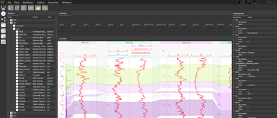
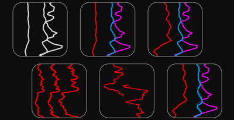
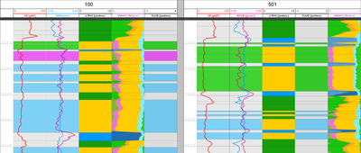
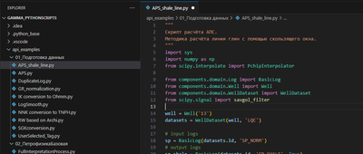

# Инструкция для ПО Гамма

Добро пожаловать в инструкцию по использованию программного продукта Гамма. Продукт создавался таким, чтобы пользоваться им можно было без каких-либо инструкций. Однако, если у вас появилось желание ознакомиться с базовой логикой имеющихся инструментов, дополнительно повысить производительность работы в нашем продукте или просто узнать детали методик, заложенных в различные инструменты — все это вы найдете в данной инструкции.

Приятной работы.
Команда разработки ПО "Платформа Гамма"

-	[Установка ПО](install/index.md)
	
- [Пользовательский интерфейс](ux/index.md)
	
- [Обзор процесса работы в ПО](workflow/index.md)
	
- [Предобработка данных](processing/index.md)
	
- [Интерпретация данных ГИС](interpretation/index.md)
	
- [Написание алгоритмов на Python](python/index.md)
	

