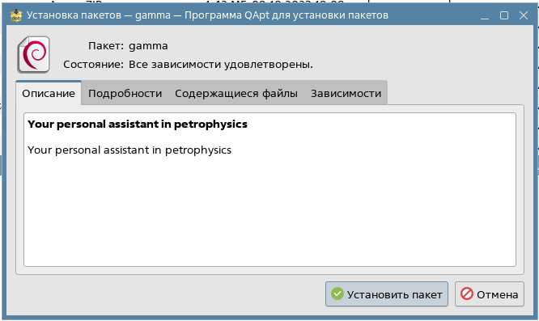
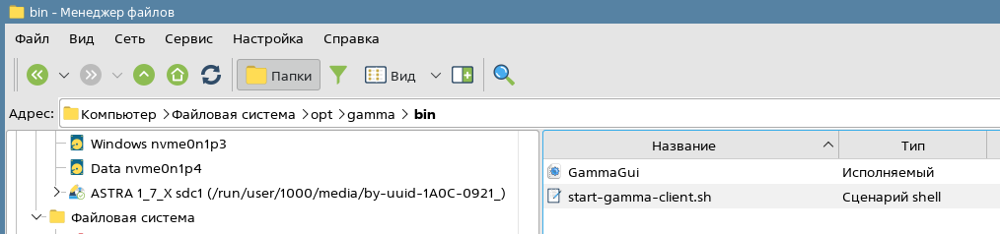
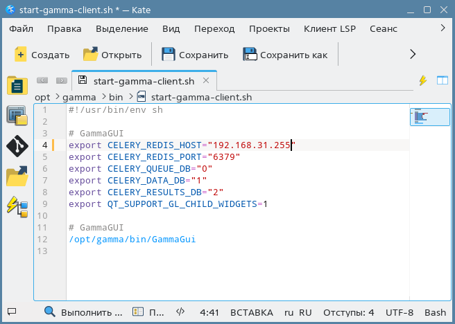
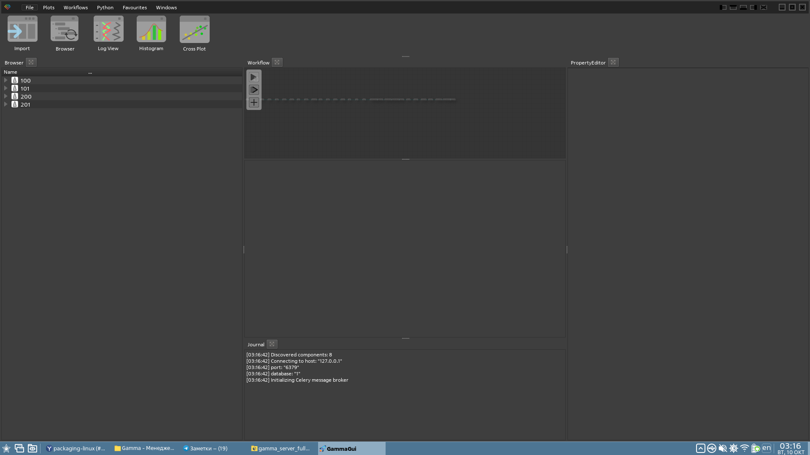

# Шаг 3. Установка клиента для Linux систем

## Универсальный процесс установки клиента для Linux систем

Установка дистрибутива пользовательского интерфейса для актуальных версий Linux (Ubuntu, Debian, Fedora, Arch)

Скачать последний дистрибутив по ссылке (нужно предварительно авторизоваться на сайте):  [Client_linux](https://gamma-wellbore.com/download/client_linux/)

Разархивировать архив стандартными средствами и перейти в терминале в распакованную папку:

Перед запуском ПО Гамма необходимо указать IP адрес серверной части приложения следующей командой:

export CELERY_REDIS_HOST=X.X.X.X       где X.X.X.X – IP машины запущенной в докере серверной частью

И прописать в явном виде где нужно искать недостающие библиотеки (в текущей папке с ПО):

export LD_LIBRARY_PATH=путь к текущей папке

команда pwd выводит полный путь к текущей папке, его можно скопировать.

Далее ПО запускается стандартной для Linux командой: ./GammaGui (перед / обязательно нужно поставить  точку).

Все команды и порядок их запуска:

Запущенный продукт выглядит полностью аналогично интерфейсу в Windows:

Поздравляем, можно работать в ПО Гамма в Линуксе.

## Установка на Astra Linux

Российская версия Linux  (Astra Linux) немного отличается от других версий процессом установки в связи с небольшим отставанием в используемых технологиях и драйверах. Однако в связи с актуальностью применения именно этой версии в России, мы сделали процесс запуска ПО наиболее простым. Ниже представлены основные шаги.

По умолчанию Астра Линукс имеет в составе старые библиотеки QT. Прежде чем запускать ПО Гамма, необходимо их обновить.

Для этого, запускаем менеджер пакетов Synaptic (Пуск -> Системные -> Менеджер пакетов Synaptic):

Затем добавляем дополнительные репозитории от поставщика ОС Астра Линукс (настройки -> Репозитории), добавляем все из списка:

После этого ищем библиотеку qt5-default и обновляем ее вместе со всеми связанными пакетами:

Когда библиотеки ОС обновлены, скачиваем дистрибутив  ПО Гамма, специально подготовленный для Astra Linux: [Client_astralinux](https://gamma-wellbore.com/download/release/)

После скачивания архив необходимо разархивировать в любую удобную пользователю папку и перейти в терминале в эту папку.

В Astra Linux по умолчанию идет графический менеджер пакетов (установщик программ), поэтому для установки файлов с расширением deb обычно достаточно просто кликнуть по нему 2 раза. В результате откроется менеджер установки, где нужно будет нажать кнопку **Установить пакет** и на этом установка будет завершена:

Альтернативно (если установщика QAPt по каким-то причинам нет в системе) необходимо запустить установщик следующей командой из командной строки (из приложения Terminal Fly):

sudo dpkg -i “название.deb”

например:

sudo sudo dpkg -i “gamma_1.0.5_amd64.deb”

В результате установки любым из способов на рабочем столе появится иконка “Гамма”:

Если серверная часть ПО находится на той же рабочей станции, что и клиентская, то далее ничего делать не нужно. Можно запускать ПО и пользоваться.

В случае если Podman и серверная часть установлены на другой станции или кластере (рекомендуется), то необходимо один раз настроить IP адрес подключения к БД Гамма (Podman). Для этого открыть папку с установленным ПО:

/opt/gamma/bin/

Открыть и отредактировать в любом текстовом редакторе скрипт-файл:

start-gamma-client.sh

В нем необходимо прописать адрес сервера Докера в строке:

export CELERY_REDIS_HOST=”Написать IP адрес станции с Podman”

Поздравляем, теперь можно открывать продукт Гамма с рабочего стола с помощью обычного ярлыка и начинать работу.

