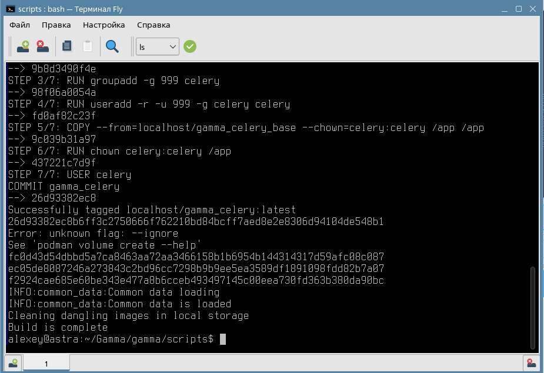

# Шаг 2. Установка или обновление серверной части

## Общий процесс установки на Linux

Первичная установка серверной части ПО или его обновление производятся полностью одиноково.

**ВАЖНО. Пользовательские данные в БД при обновлении будут сохранены.**

Если по каким-либо причинам нужно полностью переустановить сервреную часть с удалением всех данных, это можно сделать с помощью скрипта: 

```
clear_db.sh
```

Процесс установки и обновления:

1. Необходимо скачать файл с дистрибутивом серверной части:
[ссылка на сайт gamma-wellbore.com](https://gamma-wellbore.com/download/server_linux_podman/)

2. Разархивировать скаченный дистрибутив:


3. Зайти в папку в папку scripts через терминал:


Самый простой способ открыть папку со скриптом в терминале - это нажать на файл build_gamma.sh правой кнопкой мыши и в контекстном меню выбрать - "Открыть с помощью". Далее выбрать Terminal Fly (для Астра Линукс) (опция "Из меню") и нажать Открыть:


Обновление серверной части может занять около 5 минут:


И закончится сообщением, что процесс завершен успешно (Build is complete):



Можно закрывать окно и продолжать работать в обновленной версии ПО.

Обновление серверной части происходит гораздо реже, чем обновление клиентской (интерфейсной) части, про который можно прочитать здесь: [client_update](client_update.md)


## Установка на REDOS


Рекомендуется использовать права root пользователя:

```
sudo su
```

Также рекомендуется отключить selinux:

[Cсылка на инструкцию на сайт производителя REDOS](https://redos.red-soft.ru/base/arm/arm-other/disable-selinux/)

Сама установка производится следующей командой:

sh build_gamma.sh


В результате серверная часть установится, но в логе отобразятся 2 ошибки:


Обе ошибки не влияют на работу программы, связаны с ядром операционной системы и на данный момент решения по их устранению у разработчиков ОС REDOS нет. Вероятнее всего они будут решены в следующих версиях ОС, т.к. у более нового продукта - Fedora таких проблем нет.