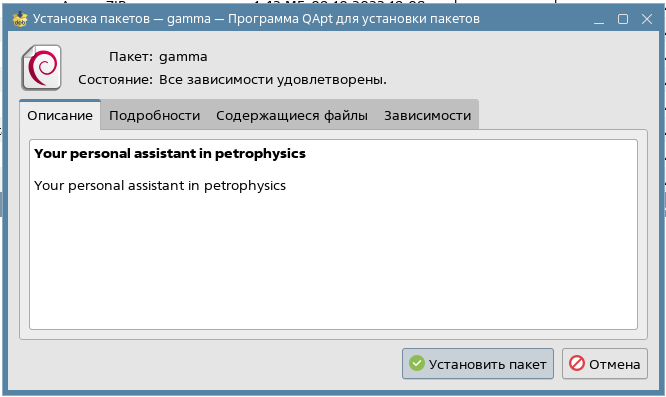

# Обновление дистрибутива пользовательского интерфейса для Astra Linux

Для обновления клиентской части (наиболее частый вариант), скачиваем дистрибутив  ПО Гамма, специально подготовленный для Astra Linux: [Client_astralinux](https://gamma-wellbore.com/download/release/)

После скачивания архив необходимо разархивировать в любую удобную пользователю папку и перейти в терминале в эту папку.

Для установки файлов с расширением deb обычно достаточно просто кликнуть по нему 2 раза. В результате откроется менеджер установки, где нужно будет нажать кнопку **Установить пакет** и на этом установка будет завершена (предыдущая версия ПО будет заменена на обновленную):

Поздравляем, теперь можно открывать обновленную версию Гамма с рабочего стола с помощью обычного ярлыка и продолжать работу.

