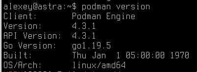

# Шаг 1. Установка Podman на Linux системах

## Общее описание

Продукт Podman официально поддерживает следующие операционные системы: Ubuntu, Debian, Fedora, Arch, Manjaro, Alpine, CentOS и другие. Полный список всех поддерживаемых систем и подробные  инструкции для установки для каждой из них представлены на официальном сайте:

[https://podman.io/docs/installation](https://podman.io/docs/installation)

## Требования к системе для работы на Linux

- для тестирования и использования на не больших проектах до 200 скважин и не более 5Гб данных – 8Гб RAM (маленькие проекты будут работать даже на 4Гб RAM)
- для использования с большими проектами, рекомендуется иметь не менее 32Гб RAM
- специфических требований к процессору нет, основное правило – чем больше ядер для параллельных вычислений, тем быстрее будут происходить все вычисления в продукте. Зависимость условно-линейная.
- установленный Python 3.9 и новее См. [Подготовка. Обновление Python на Astra Linux](Подготовка.%20Обновление%20Python%20на%20Astra%20Linux.md)


## Установка Podman для CentOS и подобных Linux

Установка на текущие версии Linux очень проста. Обычно достаточно ввести следующие команды:

* Установка Podman:
```
sudo apt-get -y install podman
```

* Проверка версии:
```
podman version
```

Необходимо убедиться, что вы используете версию Podman не ниже 4.3.1, лучше 4.5 и выше. На старой версии 3, контейнеры работать не будут.

Проверка работоспособности Podman запуском проверочного контейнера (нужен доступ к интернет):
```
podman run hello-world
```

На этом установка Podman для актуальных версий Linux завершена.

В большинстве случаев приведенной инструкции достаточно, однако разработчик ПО Гамма рекомендует пользоваться инструкций с официального сайта при установке:

[Установка Podman на Linux системы (podman.io)](https://podman.io/docs/installation#linux-distributions)


## Установка Podman на Astra Linux

Версия Astra Linux имеет старое ядро, основана на довольно старом Debian 10. В связи с этим для того, чтобы установить Podman требуется чуть больше операций, чем при установке на актуальные версии Linux.

Ниже представлены все требуемые шаги:


+ обновляем систему
```
sudo apt -y update && sudo apt -y upgrade
```

+ убеждаемся что #Python установлен
```
sudo apt install python3 python3-pip
sudo pip3 install --upgrade pip
```

+ установливаем используя Kubic libcontainers repository
```
sudo apt update && sudo apt install wget lsb-release -y
source /etc/os-release
wget https://download.opensuse.org/repositories/devel:/kubic:/libcontainers:/stable/Debian_10/Release.key
cat Release.key | gpg --dearmor | sudo tee /etc/apt/trusted.gpg.d/libcontainers.gpg >/dev/null
```

+ Добавляем [Kubic libcontainers repository](https://download.opensuse.org/repositories/devel:/kubic:/libcontainers:/stable/) в систему Астры.
```
echo "deb https://download.opensuse.org/repositories/devel:/kubic:/libcontainers:/stable/Debian_10/ /"
sudo tee /etc/apt/sources.list.d/libcontainers.list
```

+ проверяем, что при обновлении новый репозиторий видно:
```
sudo apt update
```
![[../files/Podman_Install_newRepo.png]]

+ ставим сам подман
```
sudo apt install podman -y
```

+ проверяем версию
```
podman version
```





## Установка Podman на REDOS

Рекомендуется использовать root пользователя:

```
sudo su
```

Также рекомендуется отключить selinux:

[Cсылка на инструкцию на сайт производителя REDOS](https://redos.red-soft.ru/base/arm/arm-other/disable-selinux/)

Сама установка производится следующей командой:

```
dnf install podman
```

В результате будет установлена версия 4.4 (актуально на январь 2024 года)