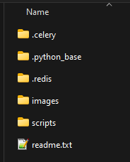
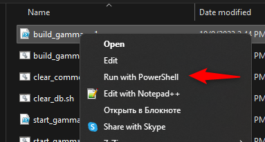
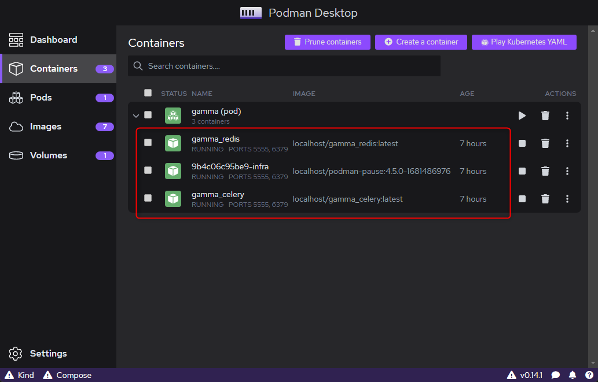

# Установка серверной части Gamma
## Установочный пакет

Инсталляции серверной части, поставляется в архиве gamma_server_full_podman.zip. В данном архиве содержаться следующие папки и файлы:

## Установка и обновление

Для установки (развертывания) образов Podman необходимо зайти в папку **Scripts** и запустить файл build_gamma.ps1 с помощью Windows PowerShell. Для этого обычно достаточно нажать правой кнопкой мыши на файл и в контекстном меню выбрать Run with PowerShell (Запустить через PowerShell):

И подождать пару минут (в зависимости от производительности рабочей станции или сервера). В результате, в Podman должна появиться группа контейнеров “gamma”: “gamma_celery”, “gamma_redis” и один технический контейнер с произвольным названием. Все 3 контейнера должны работать постоянно:

Наличие трех запущенных контейнеров в Podman говорит о том, что эта процедура завершена успешно.

При включении рабочей станции Podman стартует автоматически. Если этот автоматический вариант не подходит, то для ручного запуска можно использовать скрипт start_gamma.ps1 (Windows), а также делать это вручную в Podman Desktop.

Более подробно описано тут: [autorun](../other/autorun.md)

Назад: [index](../index.md)