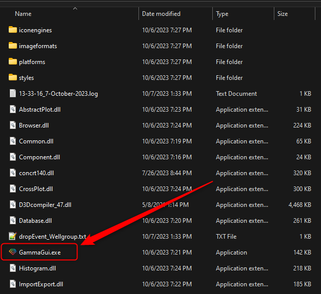
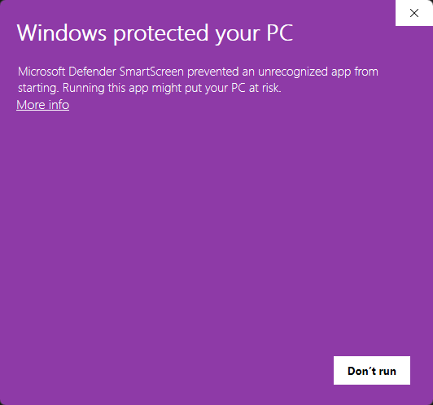
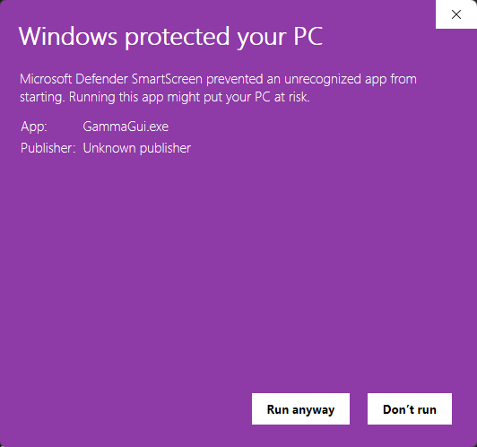
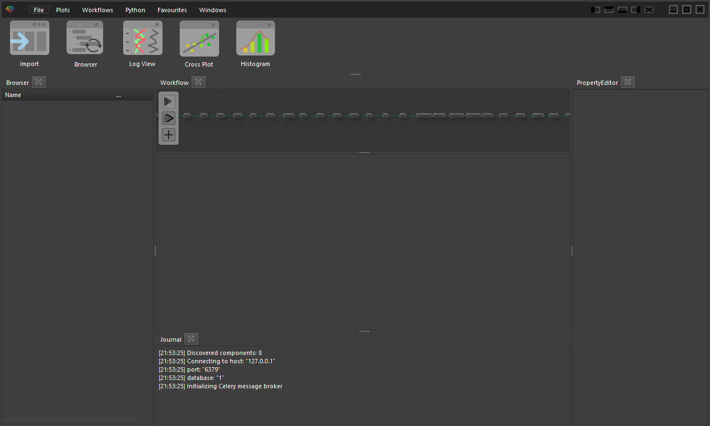
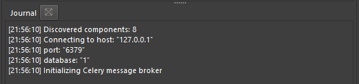

# Шаг 5. Установка дистрибутива пользовательского интерфейса для Windows

## Минимальные требования

Системные требования к пользовательской части ПО Гамма отсутствуют, однако необходимо убедиться в наличии установленных драйверов OpenGL (команда dxdiag в меню «выполнить»). При этом видеокарта должна поддерживать версию OpenGL 4.3 или выше. Это требование выполняется практически для всех современных компьютеров, включая самые бюджетные модели. Процесс проверки версии OpenGL можно найти ниже в этой инструкции.

С целью упрощения процедуры установки на этапе тестирования и облегчения задачи обновления продукта при совместной активной разработке с Заказчиком, интерфейсная часть предоставляется в виде запакованного архива с именем gamma_client.zip и не требует установки.

Данный архив необходимо распаковать в любую папку на рабочей станции пользователя и запустить файл **GammaGui.exe**

Только при первом запуске ПО возможно возникнет окно с предупреждением, что у продукта нет электронной подписи от Микрософт. К сожалению, получение данной подписи с действующими в данный момент в России санкционными ограничениями затруднительно:

Для запуска ПО достаточно нажать “More Info” (Больше информации). Далее нажать на появившуюся кнопку “Run Anyway” (Все равно запустить). Делать это нужно только первый раз при запуске дистрибутива. В дальнейшем подобное сообщение появляться не будет.

В результате появится главное окно продукта:

В нижней части экрана, в окне Journal будет прописан адрес сервера, с которым вы в данный момент работаете (в примере это адрес 127.0.0.1):

Поздравляем, можно начинать работать.