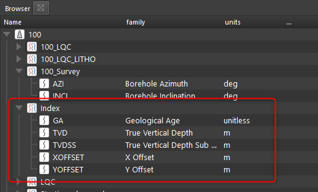

# Расчет инклинометрии

После того как инклинометрия загружена (см. [Импорт инклинометрии](../../ioс/input/import_inclinometry.md))

Необходимо перенести кривые угла и азимута в набор данных LQC. Кривые только из этого набора используются для расчета актуальной инклинометрии. Сделать это можно либо вручную, перетащив кривые из одного из датасетов в LQC, либо с помощью инструмента создания LQC, который сделает это за пользователя.

Далее расчет инклинометрии можно запустить для одной или нескольких скважин если выбрать их в браузере проекта, нажать ПКМ и далее Run Workflow -> Расчет инклинометрии:

За этот расчет отвечает нода Trajectory (Траектория). В дальнейшем можно будет настроить параметры расчета инклинометрии нажав на эту ноду.

Также могут быть использованы данные Альтитуды. Они должны быть загружены в свойство скважины EREF:

В результате расчета будет создан датасет [[index dataset]] со всеми нужными кривыми

Если альтитуда указана в скважине, то будет рассчитана кривая TVDSS, если нет, то только TVD.

Для расчета инклинометрии используется методика минимальной кривизны.