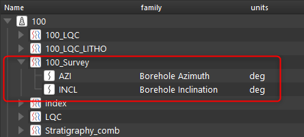
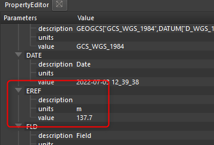

# Расчет инклинометрии

Расчет инклинометрии происходит автоматически во всех скважинах, где есть угол и азимут ствола:

За этот расчет отвечает нода Trajectory (Траектория):

Также могут быть использованы данные Альтитуды. Они должны быть загружены в свойство EREF:

В результате расчета будет создан датасет [[../ux/index]] со всеми нужными кривыми

Для расчета инклинометрии используется методика минимальной кривизны.