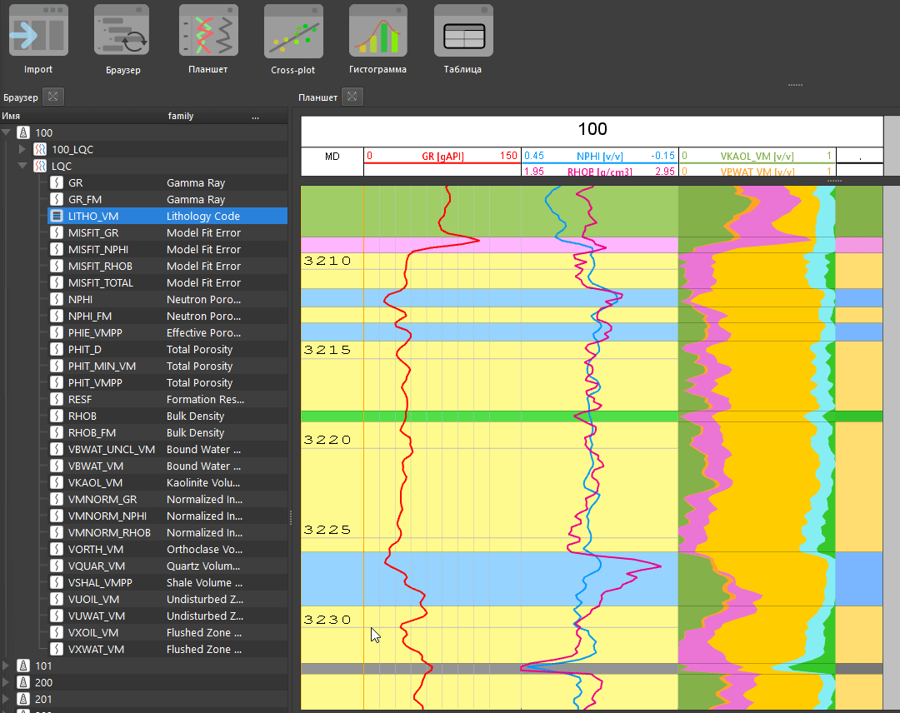
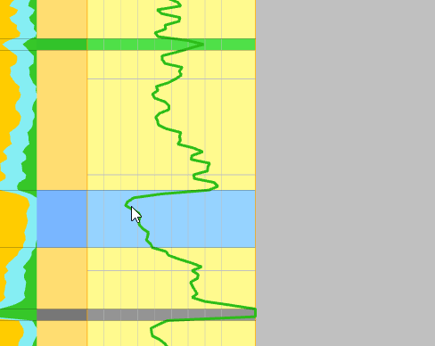
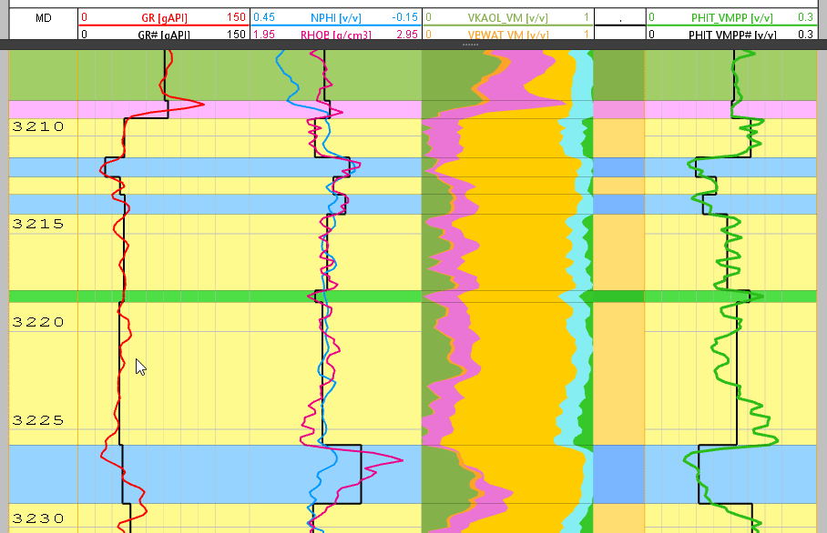
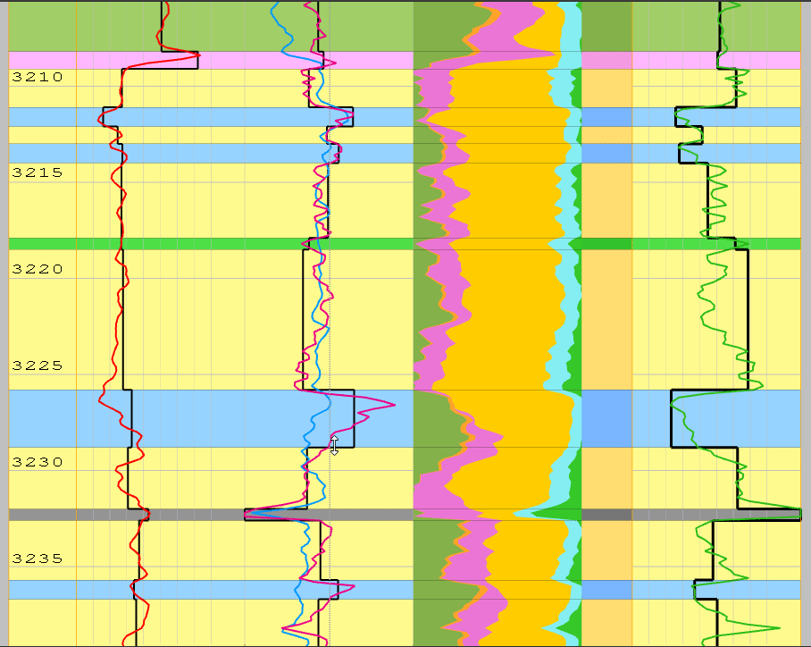
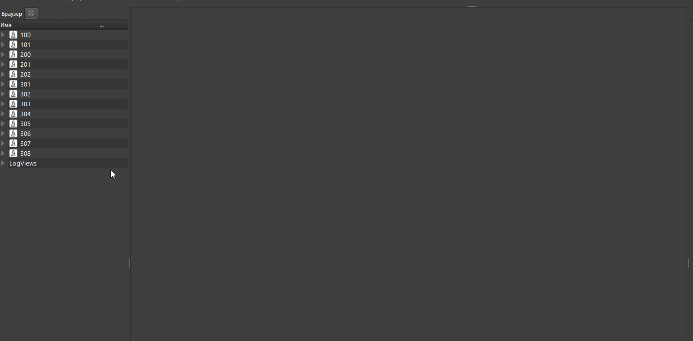

# Осреднение кривых в пределах имеющихся интервалов

## Получение осредненных значений

Для осреднения кривых можно воспользоваться несколькими имеющимися способами:

### Осреднение во всех скважинах

Необходимо запустить встроенную функцию (ноду) осреднения. Для этого  выбираем одну или несколько скважин, где будет произведено осреднение и уже есть блоковая кривая с интервалами пропластков (например LITHO). Нажать на нее ПКМ и в выпадающем меню выбрать опцию "Запустить процесс -> 4_Попластовка":

В результате чего во всех выбранных скважинах появятся осредненные кривые (в текущей версии, временно, необходимо обновить браузер чтобы увидеть новые данные), у которых будет имя и тип полностью соответствовать исходным данным, но к имени будет добавлен суффикс решетка #

Чтобы увидеть результат осреднения, нужно просто кинуть его на планшет, как обычную кривую.

???+ "Демонстрация"
	

### Осреднение кривой на планшете

Если какой-либо кривой не было осреднено на предыдущем шаге, то можно вручную запустить процесс для любой кривой в БД непосредственно с планшета. Для этого:
1. На планшете должна присутствовать кривая с пропластками (LITHO или другая)
2. Нужно выбрать кривую для осреднения, нажать на нее ПКМ и выбрать "Сделать попластовую кривую":

???+ "Демонстрация"
	

## Редактирование осредненных значений

Для редактирования ранее осредненных значений, нужно выделить кривую которую нужно поправить и нажать на нее ПКМ, выбрать в меню "Редактировать значения":

???+ "Демонстрация"
	

## Одновременное редактирование пропластков и значений

Продукт Гамма предоставляет пользователю возможность редактировать одновременно и кровлю-подошву каждого пропластка, снятые с него значения и значения самой флаговой кривой, которая используется в качестве пропластков. Необходимо отметить, что каждый раз при изменении положения пропластка или при добавлении новых пропластков, происходит автоматическое снятие отсчетов со всех используемых кривых:

???+ "Демонстрация"
	

### Редактирование в многоскважинном режиме

Особенное удобство и скорость в работе добавляет возможность делать все вышеперечисленные операции в многоскважинном режиме на корреляционной схеме.

Все операции, которые делает пользователь сразу сохраняются в базу данных и доступны другим пользователям ПО.