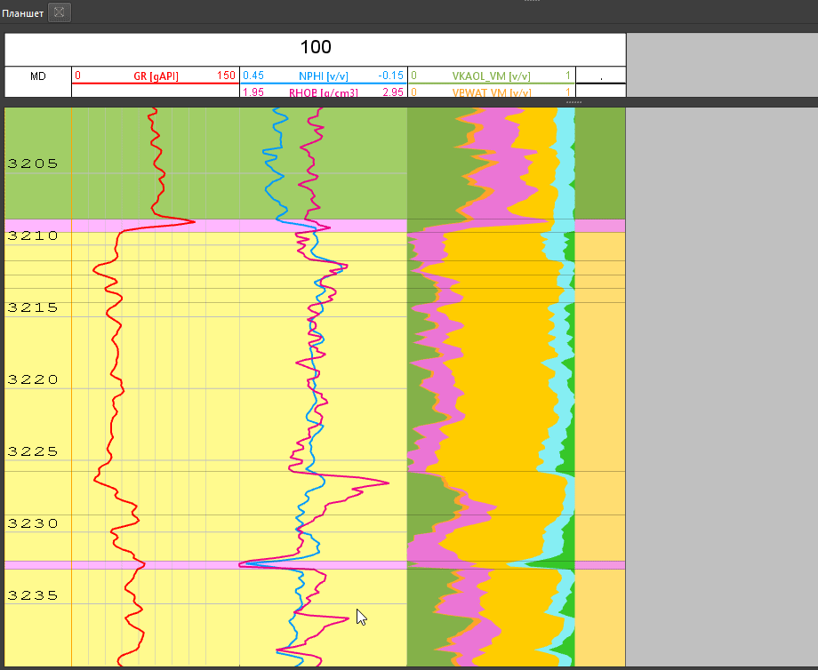

# Разбивка на пропластки

### Теория

В качестве кривой, которая будет хранить информацию о кровле и подошве пропластков может использоваться любая блоковая кривая, например литология (LITHO), флаговая кривая характера насыщенности (FLUID) либо даже просто кривая зон (ZONE).

Получить ее можно различными способами, но основные из них это:
- получить кривую LITHO_VM автоматически при расчете объемной модели;
- создать кривую LITHO вручную с одним интервалом от кровли до подошвы кривых и разбить на пропластки полностью руками;
- создать LITHO (или другую флаговую кривую) с предварительной разбивкой на группы/фации/литологии согласно заданной пользователем логике;
- загрузить из внешнего источника;
- использовать предыдущую интерпретацию, скопировать ее и отредактировать при необходимости.

Ниже будут рассмотрены 2 основных варианта работы в попластовом режиме:
1. Пользователь полностью работает в поточечном режиме, рассчитывает все ФЕС, флаговые кривые. После этого переводит все в попластовый режим. На последнем этапе пользователь считает некоторые параметры в попластовом режиме (Кпр, Кв, Кн и т.д.)
2. Сразу после загрузки каротажных данных пользователь определяет пропластки любым способом и далее работает полностью в попластовом варианте.

??? "Дополнительно о попластовом режиме"
	Необходимо отметить, что ранее попластовый режим выгодно отличался от поточечного тем, что вычисления происходили значительно быстрее, т.к. при работе с пропластками данных для расчета на 1-2 порядка меньше. В данный момент, когда любые расчеты происходят очень быстро, это достоинство потеряло актуальность.
	В то же время, многие современные данные не возможно обработать в поточечном режиме (ЯМК, скважинные имиджеры, АКШ и т.д.), что делает первый вариант, т.е. работу в поточечном режиме более универсальным и предпочтительным. Кроме того, чаще всего все остальные специалисты - сейсмики, геологи, разработчики работают с данными исключительно в поточечном режиме, т.к. требуется перемасштабирование данных на сетку (например), а перемасштабировать исходные поточечные данные значительно более корректно, чем попластовые (фактически это двойное перемасштабирование).

### Практика

#### Как отобразить пропластки

Если кривая с пропластками у вас уже есть в скважине (например в результате расчета объемной минералогической модели), то для ее отображения можно просто кинуть кривую на планшет:

Далее, чтобы увидеть пропластки на всем поле текущей скважины, необходимо нажать ПКМ на кривую, которую пользователь хочет использовать для этой цели и в контекстном меню выбрать опцию **"На всех треках"**:

#### Редактирование пропластков

Чтобы начать редактирование, необходимо нажать на кривую с пропластками, которую нужно отредактировать и выбрать в меню опцию **"Редактировать"**:

Все опции редактирования границ пропластков:
- Сдвинуть границу пропластка - просто навести на границу и подвинуть при нажатой ЛКМ
- Добавить новую границу - навести на нужное место **в пределах трека блоковой кривой** и удерживая кнопку ++ctrl++ (появится линия на весь планшет текущей скважины) нажать ЛКМ.
- Удалить одну или несколько границ - перетащить данную границу до другой и она удалится

#### Редактирование значений флаговой кривой

Одновременно с редактированием границ интервалов пользователь может изменять значения флаговой кривой. Для этого достаточно кликнуть на нужный интервал ПКМ и из выпадающего меню выбрать нужное значение:

