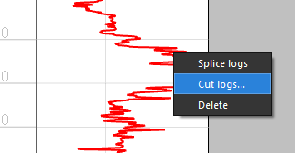
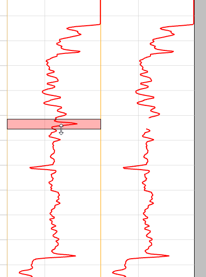
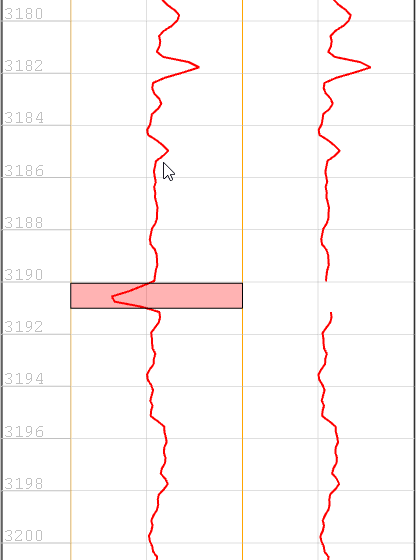
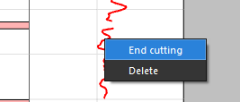
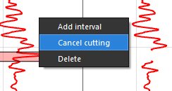

# Удаление части кривой

Если пользователю требуется удалить какую-то часть кривой, то для этого есть специальный интерактивный инструмент на планшете.

Для начала его использования, нужно кликнуть на нужной кривой [[../terms/basics/rmb]] и выбрать в меню вариант Cut Logs (Удаление части кривой):

В результате этого  действия на текузем треке появится интервал для удаления, а также добавится новый трек с результатом удаления этого  интервала:

Далее, аналогично инструменту [log_splice](log_splice.md) можно двигать интервал за верхнюю или нижнюю границу, а также перемещать весь интервал и сразу же видеть изменения на итоговой кривой:

Также пользователь может добавить еще несколько интервалов для удаления:

Для завершения процесса и сохранения результата, достаточно вызвать контекстное меню по нажатию [[../terms/basics/rmb]] на результирующем треке и нажать End Cutting (Закончить удаление интервалов):

В результате чего кривая с суффиксом "cut" будет сохранена в базе данных:

Для отмены процесса удаления части кривой, необходимо кликнуть [[../terms/basics/rmb]] на трек с исходной кривой и выбрать опцию Cancel cutting (Отменить обрезку)

