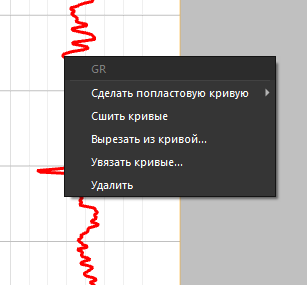
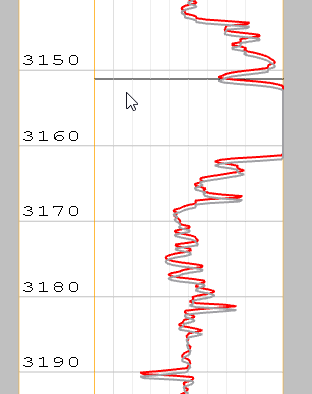
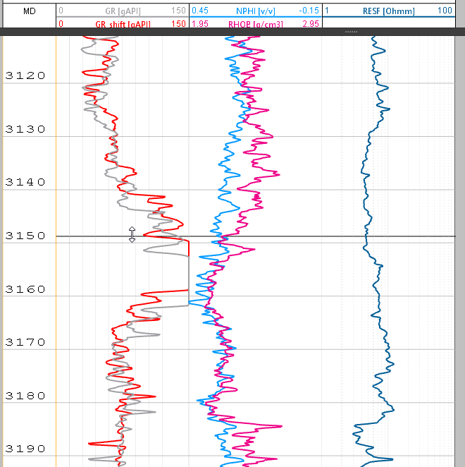
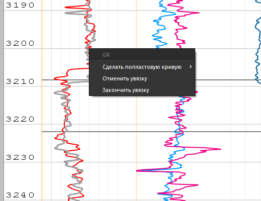

# Увязка кривых

Для начала увязки кривой, необходимо выбрать нужную кривую и нажать на том месте где будет первая точка увязки [[../terms/basics/rmb]], затем выбрать в контекстном меню пункт **Увязка кривых**

В итоге появится первая точка увязки, за которую можно двигать:

Далее при нажатии ++ctrl++ можно добавлять дополнительные точки увязки:

В любой момент можно закончить увязку или отменить. Для этого достаточно нажать [[../terms/basics/rmb]] на кривую и выбрать соответствующий пункт

При выборе **завершить увязку**, кривая сохраниться в БД с суффиксом **shift**.