# Сшивка кривых

Сшивка кривых может происходить в автоматическом режиме и в полностью ручном варианте. На данной странице описаны инструменты интерактивной ручной сшивки кривых.

Для начала процесса сшивки, нужно выбрать исходную кривую на планшете, нажать на нее правой кнопкой мыши и выбрать режим Splice logs (Сшивка кривых):

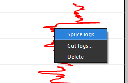

После этого добавится новый трек с результатами сшивки, а выбранная кривая будет от начала до конца представлена в виде интервала:

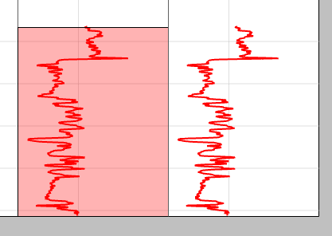

Этот интервал можно изменять за верхнюю границу или нижнюю. Одновременно будет изменяться результат:

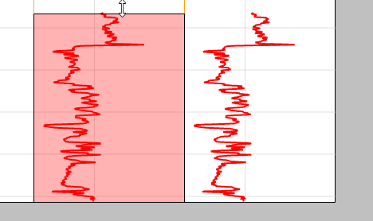

Чтобы добавить еще одну кривую для сшивки, достаточно кликнуть на нее правой кнопкой мыши и в контекстном меню выбрать Add to splicing (Добавить для сшивки):

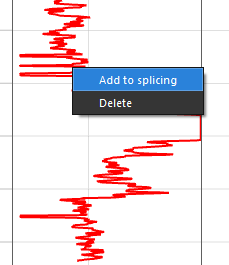

В результате этого действия, на итоговом треке появятся данные из нового интервала:

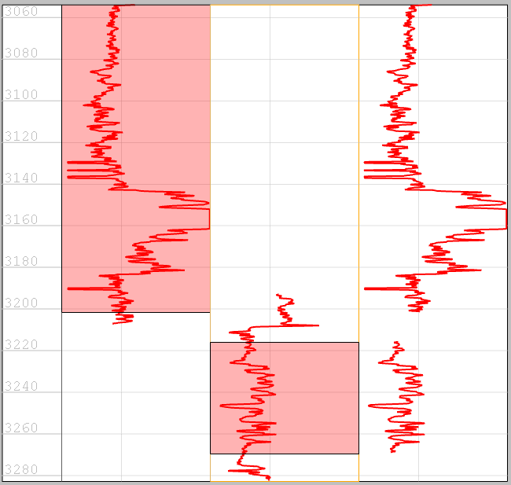

Далее пользователь может настраивать эти интервалы так как ему нужно:

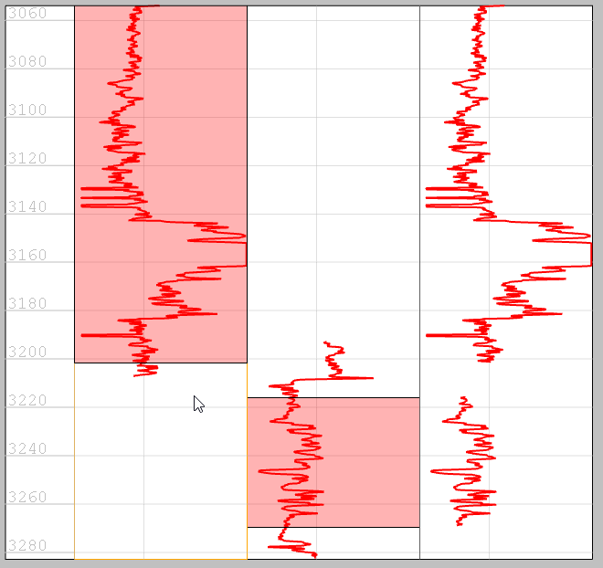

Если интервал двух кривых в каком-то месте перекрывается, то данные будут взяты из той кривой, которая ближе к результату сшивки. Для того, чтобы изменить порядок кривых (треков) на планшете, достаточно выбрать нужный трек и сдвинуть его клавишами "вправо/влево" на клавиатуре (стрелки):

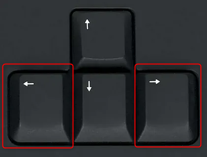

Демонстрация того, как изменяется порядок треков на планшете и как это влияет на  итоговую кривую:

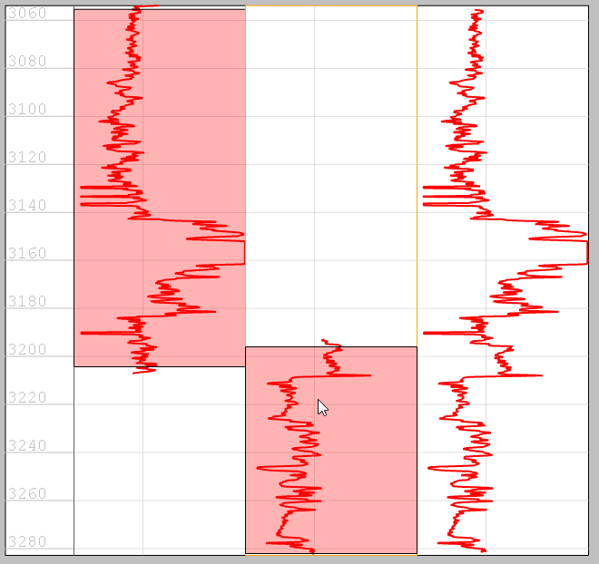

Пользователь может иметь столько кривых для сшивки, сколько захочет, например 3 и более:

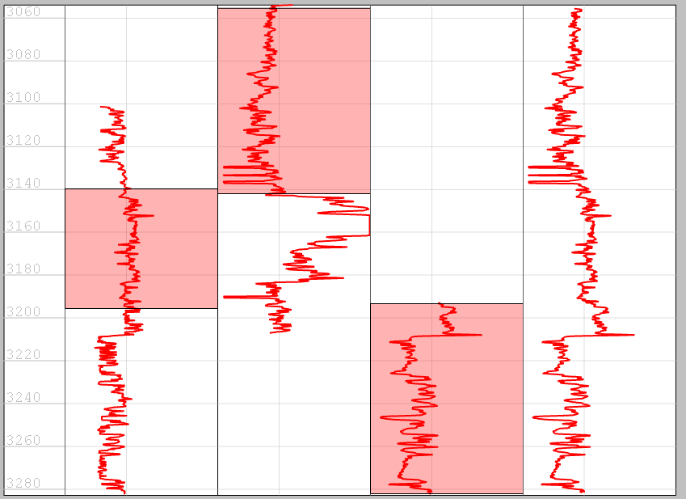

Когда пользователя устраивает результат, он может завершить сшивку. Для этого нужно кликнуть правой кнопкой мыши на результат сшивки и выбрать опцию End splicing (Закончить сшивку):

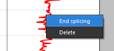

Результат будет сохранен в базу данных с именем исходной кривой и суффиксом "spliced":

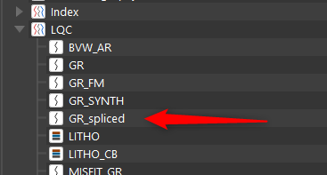

Также пользователь может удалить любой из интервалов, использующихся при сшивке, кликнув по нему ПКМ и выбрав опцию Remove From Splicing (Удалить из сшивки):

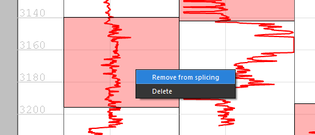

Если эта опция будет выбрана для последнего имеющегося интервала на планшете, то сшивка автоматически закончится.