# Выбор программы для написания кода

## Выбор средства написания кода 

Для написания пользовательских алгоритмов разработчики предусмотрели использование языка Python. При этом для упрощения процесса, пользователь может выбрать любой подходящий для этого [Python IDE](../terms/basics/Python%20IDE.md). Внутри самого ПО Гамма нет средств для написания программ, т.к. во-первых, на рынке уже представлена масса очень хороших вариантов таких продуктов, а во-вторых, если вы пишите код не в ПО Гамма, то он будет максимально не привязан к самому ПО, он будет намного  более униваресальный, что дает пользователям и компаниям дополнительную гибкость в перспективе.

Разработчики ПО рекомендуют в качестве средства написания алгоритмов 2 лучших решения в этой области:
- [Visual Studio Code ](https://code.visualstudio.com/) - лучше и полностью бесплатное решение от Microsoft.
- [PyCharm](https://www.jetbrains.com/pycharm/) - одно из лучших решений на рынке специализированное на Python от команды разработки JetBrains.

Кроме того, существует множество и гораздо более простых и легковестных ПО для написания кода, например [geany](https://www.geany.org/) или даже простой текстовый редактор [Notepad++](https://notepad-plus-plus.org/) с нужным плагином.

Разработчики ПО Гамма рекомендуют использовать VS Code даже не смотря на то, что по началу он может показаться сложнее из-за большого количества настроек. Однако это профессинальный инструмент, которым ежедневно пользуются миллионы программистов и он предоставляет огромное количество опций, которые сильно упростят написание вашего кода.

## Настройки программы для написания кода

Для начала необходимо переписать в любую папку на диске архив, который поставляется с ПО:

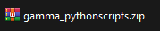

он включает в себя следующие папки:

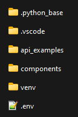

- .python_base содержит единственный файл "requirements.txt", который включает список всех стандартных библиотек Python, требуемых для работы. 
- .vscode - это настройки специально для ПО Visual Studio Code
- api_example - примеры уже написанных алгоритмов, включая стандартные петрофизические расчеты, поправки в приборы, алгоритмы создания табличных отчетов, работы с нейросетями и другие.
- venv - набор сторонних библиотек для работы с функциями Python
- components - это набор библиотек, которые обеспечивают доступ к базе данны ПО Гамма.

Далее будут рассмотрены примеры настройки различных ПО для написания скриптов на Python.

### VS Code

После установки vs code необходимо зайти в него и из меню Файл открыть папку со скриптами (gamma_pythonscripts):

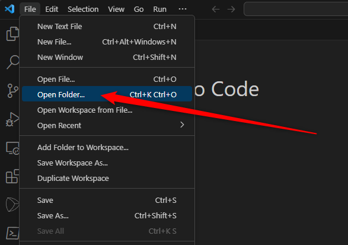

Возможно при открытии папки вы увидите вопрос, доверяете ли вы данным алгоритмам. Необходимо поставить галочку (доверяю всем скриптам в папке), ответить да и продолжить работу:

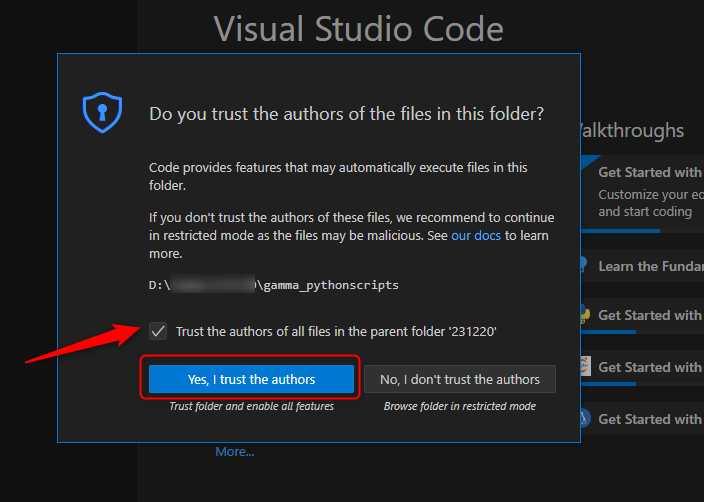

В результате откроется указанная папка в vs code:

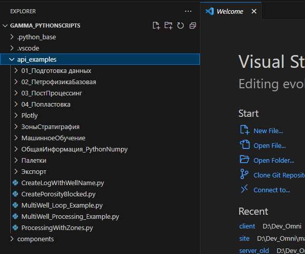

Можно нажать на любой скрипт в папке api_examples и увидеть сам скрипт:

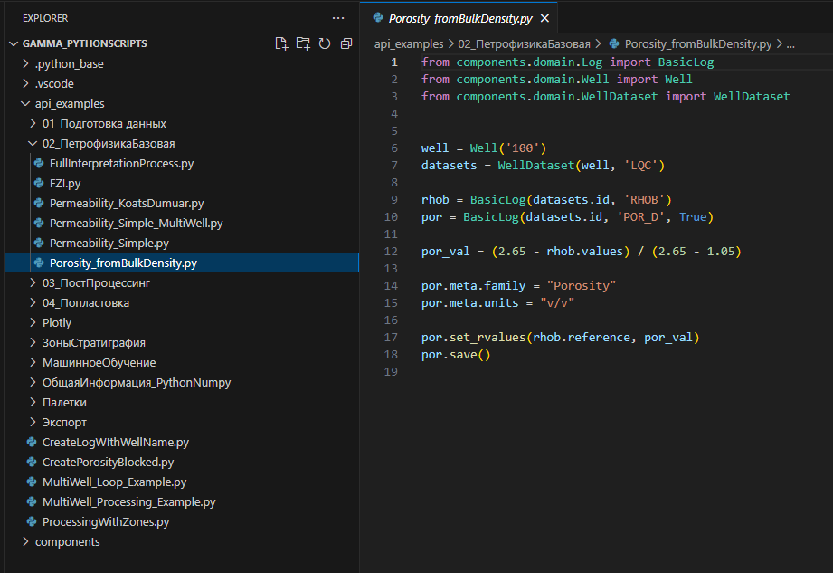

Если вы видите, что разные слова в тексте программы подсвечены разным цветом, значит vs code правильно распознал, что скрипт написан на Python и можно его запускать. Если же нет, то нужно один раз установить средство распознавания синтаксиса Python.

#### Добавление расширения Python 

Данное расширение, упрощает написание кода на Python, позволяет правильно подсвечивать синтаксис кода, находить ошибки, предлагать подсказки при написании.

Открываем закладку Расширения и ищем Python:

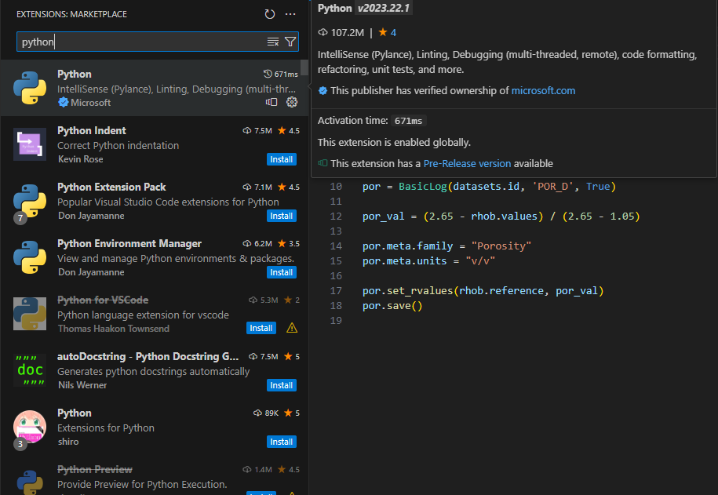

Нужное нам расширение будет самым первым. На момент написания этого документа, его установили 107 млн. пользователей!

Нажимаем кнопки Установить (Install) и после установки Активировать (Enable). На картинке ниже представлено финальное состояние, после установки и активации:

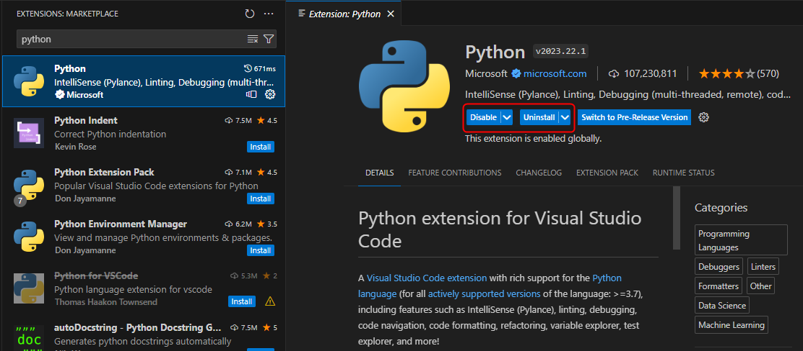

В результате этих двух настроек, у вас должна появиться правильная подсветка синтаксиса:

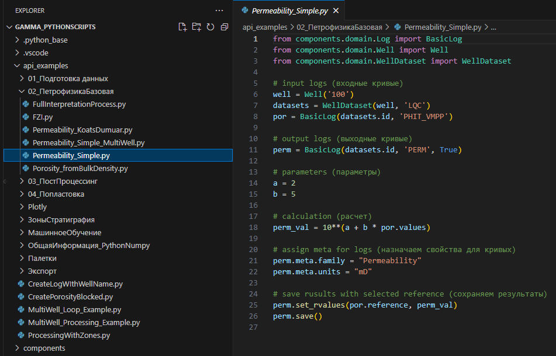

Для запуска скрипта нужно нажать кнопки CTRL+F5.

Успешный запуск скрипта будет отображен в терминале внизу примерно таким сообщением:

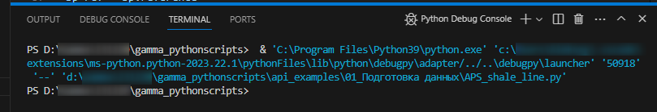

### PyCharm

Открываем папку из PyCharm:

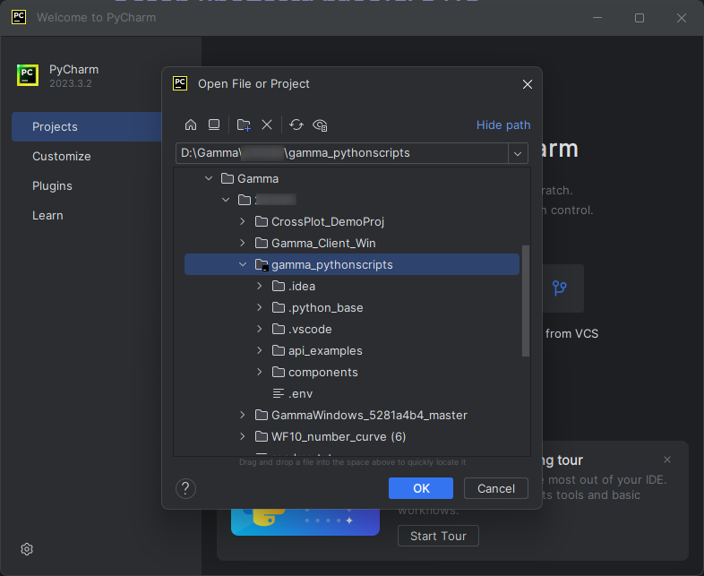

Соглашаемся что скрипты безопасные:

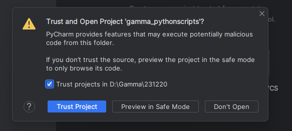

В результате видим содержимое папки и скриптов в PyCharm:

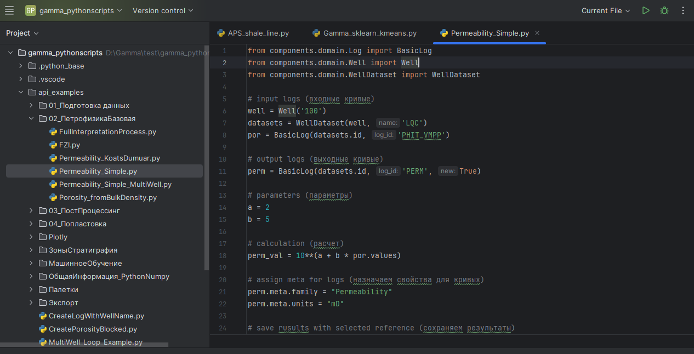

Можно выбирать готовые скрипты и запускать их, либо писать свои.

Запуск скрипта осуществляется при помощи кнопки вверху панели:

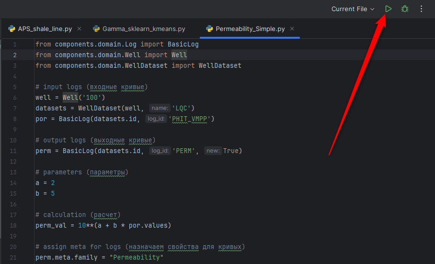

