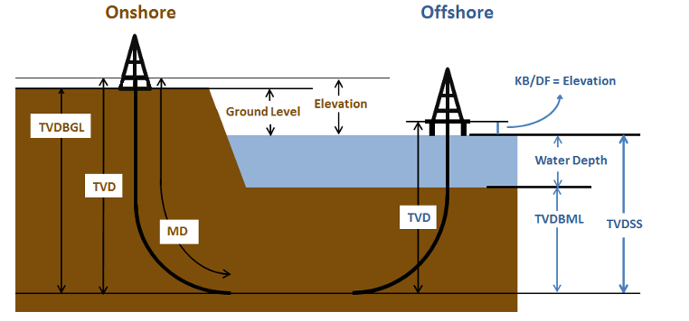

# index Dataset

Специальный датасет, в котором хранятся расчитанные данные инклинометрии, в том числе:

MD - Measured Depth (измеренная глубина)
TVD - True Vertical Depth (вертикальная глубина)
TVDSS - True Vertical Depth SubSea (вертикальная глубина с учетом высоты над уровнем моря)
TVDBGL - True Vertical Depth Below ground Level (вертикальная глубина от уровня земли)
TVDBML - True Vertical Depth Below Mud Line (вертикальная глубина от уровня дна моря или уровня поверхности земли в море)
KB/DF - Kelly Bushing/Drilling Rig Floor (высота стола ротора - там где стоит буровой инструмент и откуда делаются все измерения)
GA - Geological Age - геологический возраст
XOFFSET - отход от устья скважины по оси X
YOFFSET - отход от устья скважины по оси Y

