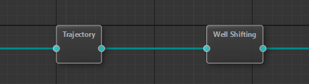

Единица рабочего процесса, обычно представляет из себя алгоритм.

Ниже представлены 2 ноды рабочего процесса: расчет траетории и межскважинная увязка каротажа.

У каждой ноды емогут быть свои индивидуальные настройки.