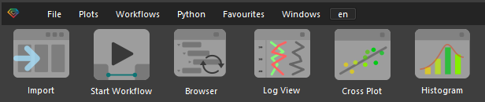
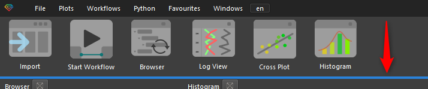

# Главное окно

Интерфейс продукта представляет собой настраиваемое окно с пятью базовыми рабочими зонами:  

* Центральная: отображение планшета, карт, кросс-плотов и прочих рабочих инструментов  
* Правая: по умолчанию в этой части отображается браузер проекта  
* Левая: окно отображения свойств объектов (Property Editor)  
* Верхняя: отображение текущего рабочего процесса (Workflow)  
* Нижняя: вывод служебной информации для пользователя (Journal)

Положения окон можно настраивать под текущие задачи пользователя. Например, можно расширить центральную рабочую область экрана и перенести окно рабочих процессов и журнал в правую часть основного окна:

Либо следующим образом:

В верхней части основного окна располагаются иконки для запуска базовых инструментов продукта:

Размер этих иконок можно увеличить или уменьшить, вплоть до минимального размера и без отображения подписей (когда они станут не нужны пользователю). Для этого достаточно потянуть за нижний край этого поля вверх или вниз:

**Import** – инструмент импорта данных в формате LAS

**Browser** – обновление содержимого браузера проекта, используется только после загрузки новых данных. В ближайшее время данная иконка будет убрана, а браузер проекта будет всегда обновляться автоматически.

[logview](../graph_widgets/logview.md) – планшет, для отображения каротажных данных в одно и многоскважинном режимах

[сross-plot](../graph_widgets/сross-plot.md) – инструмент отображения кросс-плотов

[histogram](../graph_widgets/histogram.md) - инструмент работы с гистограммами

Любую их четырех зон (кроме центральной) можно скрыть/показать полностью с помощью соответствующих иконок в верхней, правой части приложения:

Центральную часть приложения можно расширить на весь экран (полноэкранный режим), при помощи крайней правой иконки:

Основное окно продукта можно настроить, чтобы сделать его наиболее удобным для каждого конкретного пользователя. Приводим пример настройки, отличной от предоставляемой по умолчанию – окно рабочего процесса и журнала операций объединены с окном свойств в правой панели ПО, а нижняя и верхняя панель скрыты для того, чтобы расширить рабочую область для планшета:

Также можно временно скрыть все не использующиеся панели для максимального увеличения рабочего пространства для визуального анализа данных и корректировок:
