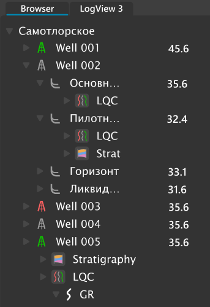

# Браузер проекта

Инструмент, который отображает содержимое проекта и позволяет удобно и оперативно работать с данными.

Структура хранения и отображения данных в проекте отвечает принятым стандартам в геофизическом ПО – отображаются 3 основных уровня – скважина, набор данных и уровень кривых.

При этом данная структура может  изменяться и усложняться добавлением уровней месторождения, заказчика, региона работ, а также стволов.

## Добавление колонок с мета-данными.

При нажатии на заголовок колонки с троеточием:

В выпадающем меню можно выбрать дополнительные колонки для отображения:

Например, при выборе families и units:

будут показаны назначенные этим данным тип и единицы измерения в отдельных колонках:

Инструмент позволяет оперативно просматривать данные, их источники, средние величины и множество других параметров. Для примера:

Ниже представлена часть рассчитываемых значений и их логический смысл:

**Basic****_statistics****.* –** группа данных, автоматически рассчитанных модулем basic statistics

**Basic****_statistics****.mean** – среднее арифметическое по кривой

**Basic****_statistics****.stdev** – стандартное отклонение

**Basic****_statistics****.avg****_step** – шаг квантования

**Method** – название метода или алгоритма, использовавшегося для расчета кривой

**Source** – указывает источник кривой (например имя LAS файла, из которого загружены эти данные)

**Family****_assigner****.*** – группа данных, получаемых в результате работы модуля присвоения типов кривых

**Family****_assigner****.reliability** – коэффициент достоверности определения типа кривой (1 – очень надежно, 0 – очень не надежно).

**Source****_units** – единицы измерения, использовавшиеся в источнике данных (например, в LAS файле). Параметр Units – отображает единицы измерения, автоматически приведенные к единому формату в проекте.

Имеющийся на данный момент список полезных расчетных параметров насчитывает более 100 разных мета-параметров и постоянно расширяется вместе с добавлением новых модулей и появлением нового функционала в продукте.

## Фильтрация данных по параметру.

Для более удобного и продуктивного анализа, данные могут быть отфильтрованы разными способами. Один из них – это возможность использования дополнительных колонок в браузере проекта.

При нажатии на заголовок любой из колонок, можно выбрать данные для фильтра:

Например, можно отфильтровать только тип Gamma Ray (Гамма каротаж):

Либо только данные, созданные инструментом расчета объемной минералогической модели:

Этот способ можно использовать для того, чтобы мгновенно выбрать кривые одного типа и отобразить их на планшете:

Необходимо заметить, что при использовании функции фильтра, можно искать по части нужного критерия. Например, если ввести Poro, то отобразятся все типы данных, у которых есть в имени это сочетание букв:

## Выбор данных по критерию

Для максимально простого и быстрого выбора данных по имени, реализован способ выбора данных на основе выделенного имени. Это осуществляется сочетанием горячих клавиш ++ctrl+w++.

Так, например, если выделить кривую **RHOB** и нажать клавиши ++ctrl+w++, то все кривые с тем же именем выделятся в проекте. После этого их, например, можно перетащить на планшет для отображения.
