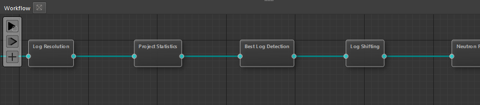

# Окно Рабочего Процесса

Для контроля процесса интерпретации, его визуального представления, а также с целью изменения настроек самих процессов интерпретации, служит специализированное окно – Workflow.

В текущей версии данное окно представляет собой отображение предустановленного процесса автоматической интерпретации, которое подходит для решения задачи интерпретации терригенного и карбонатного разреза в большинстве случаев. Далее предполагается, что пользователь будет его изменять и дополнять своими инструментами.

Также в нем заложены базовые инструменты настройки визуализации графа обработки и интерпретации. Данное окно является одним из ключевых в понимании применяемых алгоритмов и настройки параметров.

В левой части окна рабочего процесса размещено плавающее окно с основными операциями, которые можно осуществить:

1. Запустить рабочий процесс с выбранного алгоритма и далее.
2. Запустить весь процесс с начала
3. Добавить новый алгоритм из существующих или выбрать пользовательский алгоритм, написанный на Python.

Важно учитывать, что при перезапуске рабочего процесса будут запущены только те [Ноды](../../terms/basics/node.md) (процессы), в которых изменились какие-либо настройки с прошлого запуска. Т.е. если пользователь изменил один параметр в одной ноде, то даже при перезапуске всего рабочего процесса, расчет будет запущен только для этой ноды, т.к. в ней произошли изменения параметров. Кроме того, если из-за новых полученных результатов, нужно будет перезапустить какие-либо последующие или зависимые от нее расчеты, то могут быть запущены и другие алгоритмы.

На данный момент не предусмотрен запуск только одной расчетной ноды (алгоритма), т.к. это может привести к тому, что расчеты в других нодах станут не актуальными. Логика ПО Гамма предусматривает безусловный пересчет всех зависимых нод и отсутствие не согласованных друг с другом данных.

