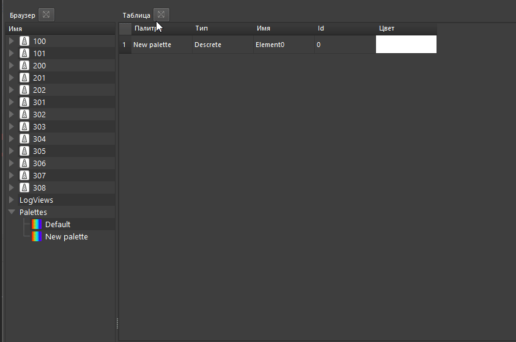
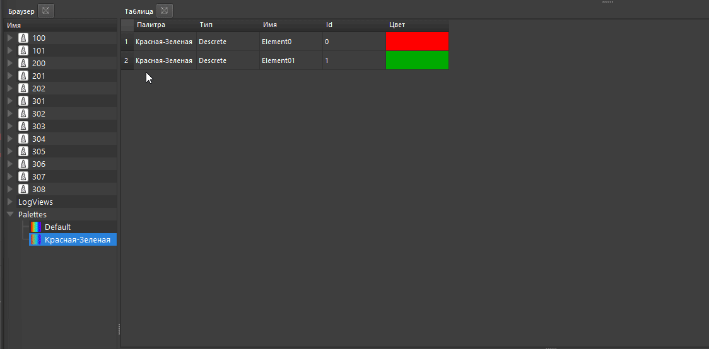
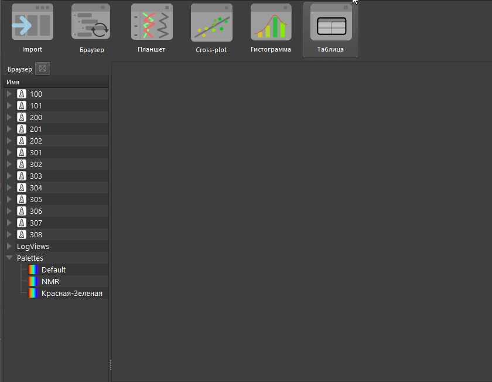

# Работа с палитрами

На данный момент дистрибутив ПО идет без предустановленных палитр. В несколько примеров будет добавлено. Однако создание палитры пользователем осуществляется в пару кликов. Ниже описана процедура.
## Создание палитры

Для создания палитры и работы с ней используется инструмент [Табличного Просмотра](../graph_widgets/tableview.md). Для начала нужно открыть этот инструмент, нажать в нем на пустое место и выбрать одну из двух опций:

### Создание базовой палитры

Если выбрать вариант "Создать базовую палитру" то будет создана стандартная палитра радуги из 7ми цветов, одновременно будет задан вопрос - нужно ли сохранить эту палитру в БД:

При сохранении палитры, она появится в соответствующем пункте в БД в браузере проекта:

### Создание пользовательской палитры

Если выбрать вариант создания пользовательской палитры

Будет создана одна строка с палитрой в табличном просмотре:

При этом в БД будет создана палитра с именем **New palette**:

## Изменение палитры

Как только создана любая палитра, ее можно начать изменять и дополнять.

Ниже на видео показаны следующие операции:

- Изменение имени палитры. При этом имя сразу же изменится в БД.
- Изменение цвета палитры
- Добавление новой строки в палитру и присвоение ей цвета

При изменении имени палитры будет создана дополнительная палитра в БД с соответствующим названием:

Если в вашей БД много палитр и вы не знаете какую выбрать, или хотите отредактировать сразу несколько, ПО Гамма позволяет отобразить их все в табличном просмотре, фильтровать и редактировать стандартными средствами:

