# Гистограмма

## Общая информация

Инструмент доступен в верхней части панели инструментов.

При открытии данного инструмента, пользователь увидит следующее окно:

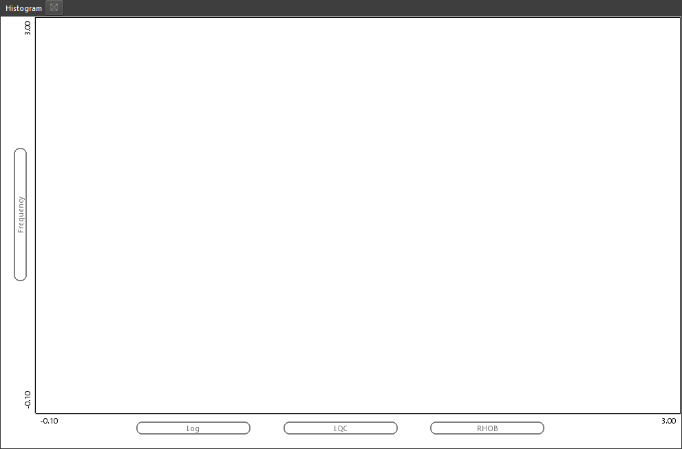

В данном примере задано значение RHOB для отображения. Также видно, что данные будут фильтроваться по имени (Log) и по датасету LQC:

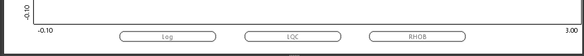

## Отображение данных

Пользователь может перенести в поле с надписью RHOB любую другую кривую для ее отображения в качестве гистограммы. Для примера отобразим кривую GR (Гамма каротаж):

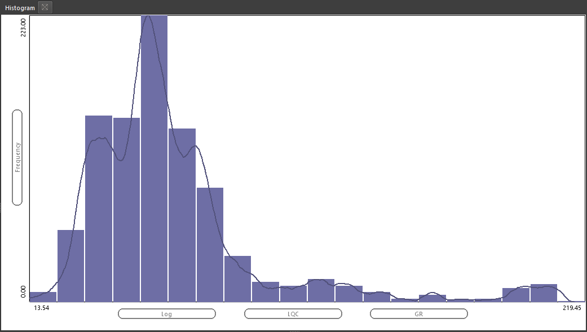

При этом будут отображены сразу блоковая и непрерывный тип гистограммы.

Далее пользователь может добавить еще данных, просто перенеся другие скважины в область гистограммы:

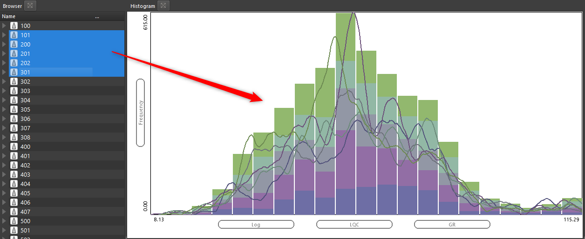

??? Example "Видео пример"
	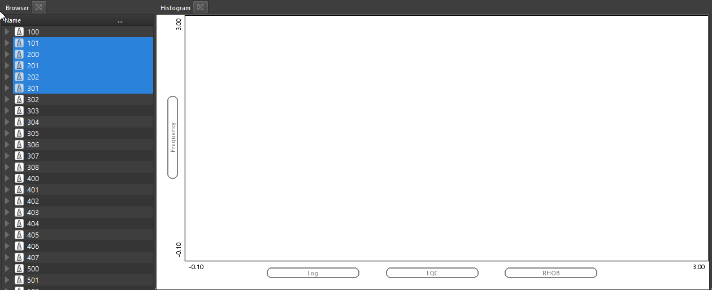

## Настройка масштаба отображения

+ изменить масштаб гистограммы (перенести ее визуально влево или вправо) можно при помощи удержания правой кнопки мыши
+ Для увеличения или уменьшения масштаба достаточно покрутить колесо мыши с зажатой клавишей CTLR
+ Также можно задать точные параметры отображения вручную, если просто вбить новые значения по осям

??? Example "Видео пример"
	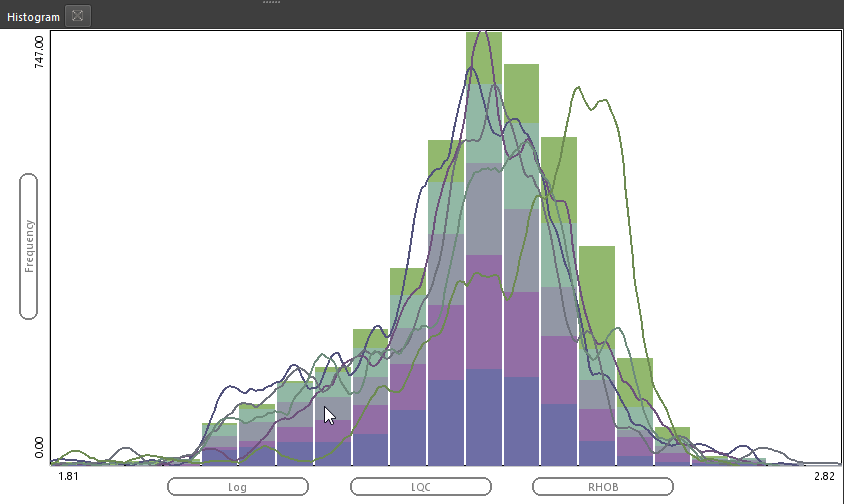

## Смена кривой для отображения

Для отображения гистограммы по другим данным, когда скважины уже определены, необходимо изменить имя в фильтре данных. Для этого пользователю достаточно перенести требуемое имя на это поле:

??? Example "Видео пример"
	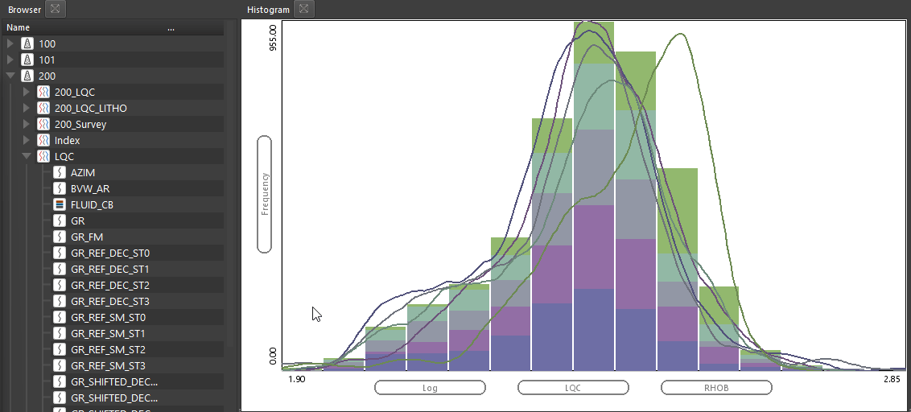

## Визуальные настройки отображения

### Блоковый и непрерывный варианты

Изменение отображения с блокового типа гистограммы на непрерывную и их совместное отображение происходит по нажатию кнопки Bins в свойствах окна гистограмма:

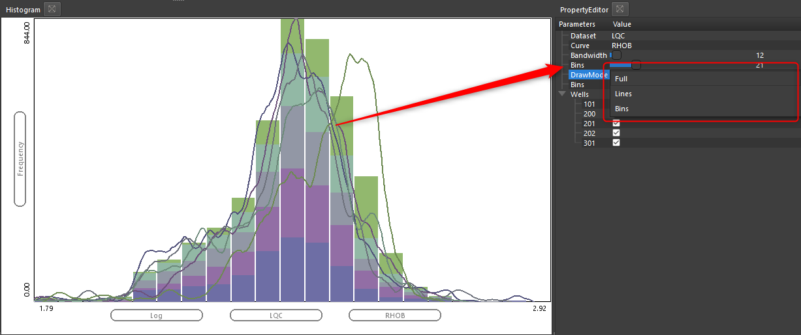

??? Example "Видео пример"
	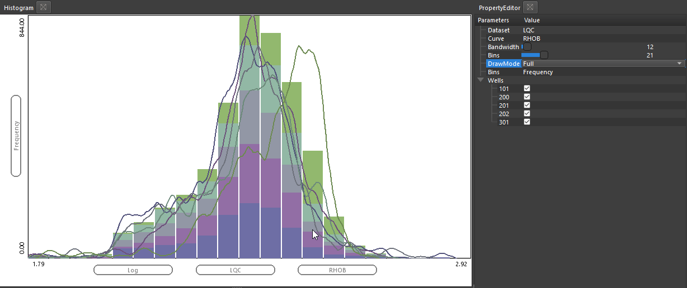

### Настройка количества карманов (бинов)

Также пользователь может динамически подобрать количество бинов на гистограмме используя ползунок в нижней части гистограммы (позже будет перенесен в свойства):

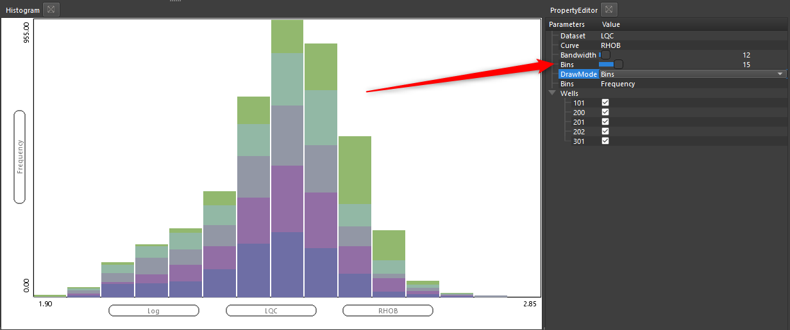

###  Настройка сглаженности кривой

Второй ползунок позволяет динамически менять сглаженность непрерывной кривой при отображении:

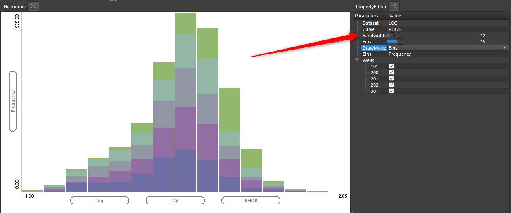

??? Example "Видео пример"
	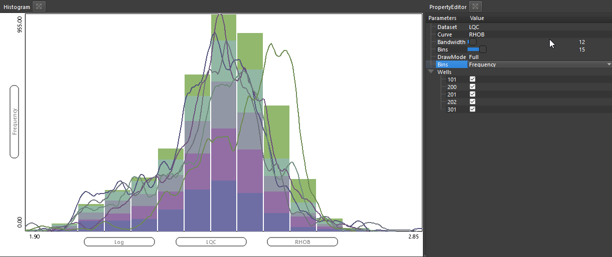

### Отображение накопленных кривых

При нажатии на кнопку Frequencies происходит изменение с отображения гистограммы в виде частот, на кумулятивный вариант отображения:

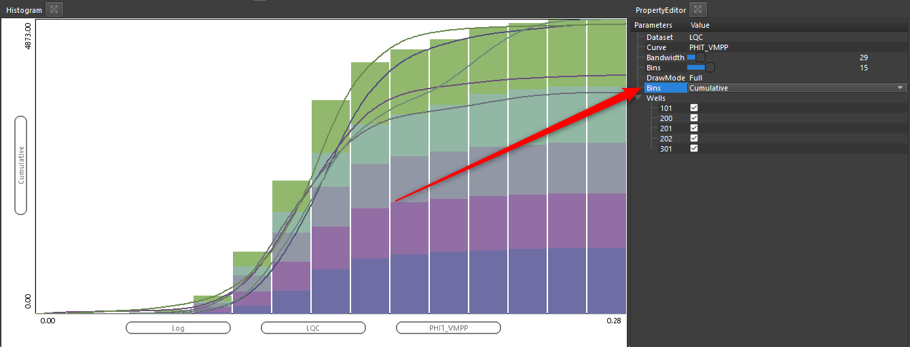

??? Example "Видео пример"
	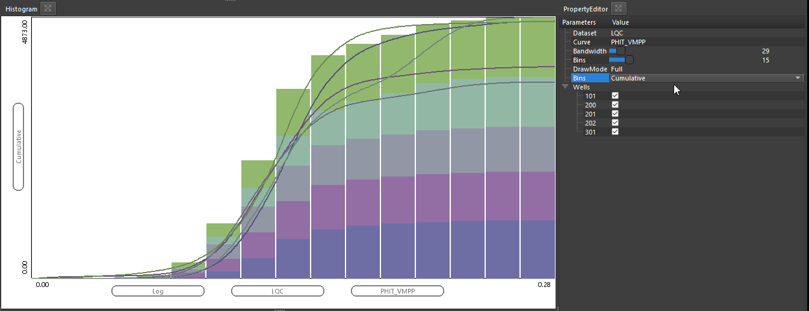

### Включение и отключение скважин

Пользователь имеет возможность включать и отключать скважины, отображаемые на гистограмме

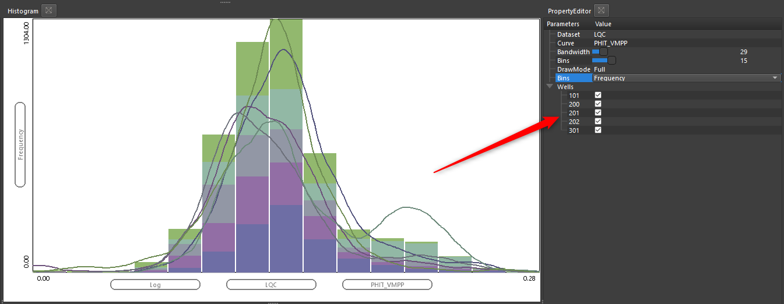

## Сохранение гистограммы

Для сохранения гистограммы достаточно нажать [ПКМ](../../terms/basics/ПКМ.md) в любом месте на графике и выбрать Save Plot (Сохранить график):

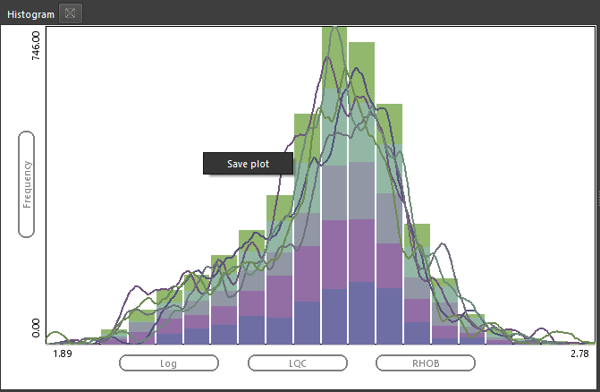

В окне сохранения будет предложено имя для графика. По умолчанию имя формируется из имени скважины или количества скважин, если их больше одной, и данных на оси X.

График будет сохранен в БД в группе гистограмм:

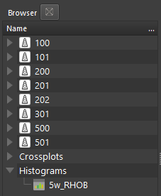

Для того, чтобы открыть этот график, достаточно перетащить его на любое открытое окно гистограммы.

??? Example "Видео пример"
	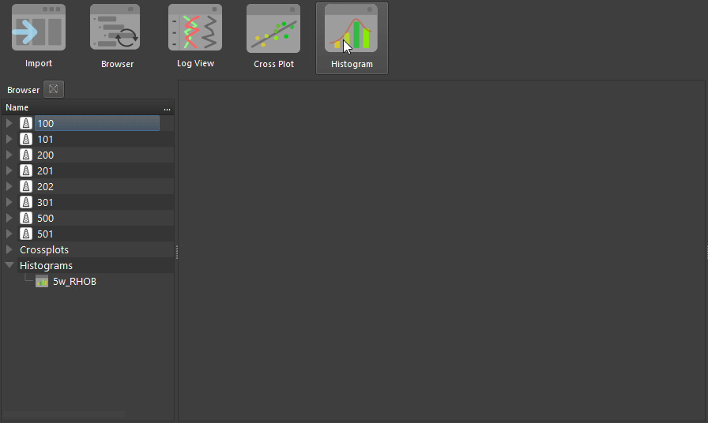