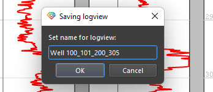

# Планшет

Окно визуализации каротажных данных (Планшет/LogView) – позволяет отображать любые скважинные данные в удобном для их анализа виде.

На первом этапе создания продукта Гамма была реализована уникальная  часть графической визуализации каротажных кривых, которая позволила  создать планшет, способный отображать практически любое количество каротажных кривых, при этом не теряя производительности. Пользователь имеет доступ к полноценному многоскважинному инструменту визуализации каротажных кривых, способный отображать как одну, так и десятки, а при необходимости, и сотни скважин, создавая наглядные корреляционные схемы и многократно повышая эффективность многоскважинного анализа.

Помимо самой современной системы отрисовки каротажных данных, был сделан акцент и на удобство использования самого планшета. Ниже представлены базовые операции, которые доступны на данный момент для пользователя.

## Отображение кривых

Для открытия планшета достаточно воспользоваться соответствующей иконкой LogView в панели инструментов:

**Отображение каротажных кривых** – достаточно выбрать нужные кривые в браузере проекта и перенести их в зону планшета:

Если выбрать кривые сразу из нескольких скважин, то на планшете будет создано соответствующее количество скважин и треков:

Если в треке уже есть кривая, то можно добавить туда еще одну кривую, просто перетащив ее в нужный трек:

Каждая кривая отображается с тем цветом и теми границами отображения, которые прописаны в базе отображения кривых в продукте.

Если в треке уже отображена кривая и в тот же трек добавляется другая кривая с аналогичным типом, то она автоматически будет отображена тем же цветом, но с другим оттенком для того, чтобы пользователь мог сразу отличить эти кривые на треке.

### Изменение вертикального масштаба кривой

Для того чтобы изменить верхний или нижний предел отображения кривой, достаточно просто кликнуть на соответствующее поле непосредственно в заголовке планшета и ввести нужное значение:

### Изменение цвета кривой и толщины линии

Данные операции производятся при нажатии ПКМ на заголовок нужной кривой:

### Изменение других свойств кривой

Ниже представлен пример изменения следующих свойств кривой на планшете:

+ отображение текста
+ изменение масштаба на логарифмический
- обратное отображение шкалы (от максимума к минимуму)
- отображение данных в виде точек (например керн)
- отображение данных соединенных линиями (обычный каротаж)

## Удаление данных с планшета

Удаление любых данных происходит путем графического выделения нужных данных и нажатия кнопки "Delete" на клавиатуре.

## Базовая навигация

Для того, чтобы двигать планшет вверх, вниз, вправо, влево, достаточно зажать среднюю кнопку мыши (колесико) и двигать мышь в нужном направлении:

### Изменение вертикального масштаба 

Изменение масштаба всего планшета производится с помощью двух базовых сочетаний, которые используются стандартно во всех приложениях в Windows.

Если нужно изменить только вертикальный масштаб, то пользователю нужно зажать клавишу SHIFT и покрутить колесом мыши в области планшета.

Таким образом, он изменит вертикальный масштаб отображения данных:

### Изменение вертикального и горизонтального масштаба одновременно 

Если же нужно изменить одновременно и вертикальный и горизонтальный масштаб («приблизить» или «отдалить» планшет) пользователю достаточно зажать CTRL и покрутить колесо мыши в нужном направлении:

## Отображение других данных на планшете

### Отображение литологии и типа флюида

Если в базе данных пользователя есть кривая литологии, имеющая тип  Lithology Code (обычно называется LITHO), которая отмечается специальным значком:

То такую кривую можно отобразить на планшете в виде литологии:

Стоит заметить, что для отображения литологии не нужно создавать какой-либо специальный трек – достаточно «закинуть» кривую, как и любую другую на планшет, программа распознает тип кривой и корректно ее отобразит.

Отображение заливок кривой происходит в соответствии с кодами в этой кривой. На данный момент приняты «по умолчанию» следующие коды и цвета соответствий для кривой литологии:

Инструмент для изменения этих значений по умолчанию будет доступен в следующих версиях продукта.

Флаговой кривой с типом флюида обычно назначается семейство **Fluid Code**, при этом название по умолчанию у таких кривых FLUID:

Палитра у подобных кривых может быть различной, но по умолчанию в продукте приняты следующие типы насыщающего флюида и соответствующие им коды:

Данный список может быть изменен и расширен по желанию пользователя. Также могут быть использованы русскоязычные названия, если это необходимо.

При переносе кривой с типом Fluid Code в область планшета, эта кривая будет отображена на планшете как флаговая кривая с применением палитры. Никаких изменений и дополнительных настроек со стороны пользователя не требуется:

### Отображение объемной минералогической модели

Объемная модель обычно состоит из нескольких кривых, отображающих различные объемные компоненты модели. Для терригенного разреза такая объемная модель может быть представлена следующими кривыми:

При этом все эти данные должны иметь тип данных, включающий часть «Volume Fraction» (объемная доля) в названии типа.

Такие кривые можно отобразить в виде объемной модели. В соответствии с принятой в продукте логикой упрощенной работы и минимального количества нажатий, для создания объемной модели не нужно создавать специальный кумулятивный трек, как это принято в других продуктах. Достаточно просто кинуть одну кривую с объемной долей компонента (обычно имеют суффикс VM) на трек и к ней добавить другую кривую из объемной модели. В результате трек переключится в режим отображения объемной модели:

Когда все нужные кривые будут закинуты в трек в нужном для пользователя порядке, отобразится полная объемная модель, включающая как минеральную составляющую, так и флюиды:

### Отображение керновых данных

Керн в базе данных ПО Gamma отображается со специальной иконкой и имеет в типе данных слово Core (Core Porosity, Core Permeability и т.д.):

Такие данные можно отобразить на планшете вместе с другими кривыми, например пористостью. В примере ниже, керновые данные отображаются вместе с пористостью, рассчитанной двумя методами – путем построения объемной минералогической модели (PHIT) и с использованием традиционной методики расчета пористости по плотностному каротажу (PHIT_D). Хорошо видно, что объемная модель значительно лучше описывает реальную пористость разреза, что наблюдается в большинстве случаев:

### Отображение стратиграфии

Стратиграфия хранится в виде блоковой кривой в одном из наборов данных. Это может быть как стандартный набор данных LQC или же отдельный набор данных с понятным именем, например Стратиграфия. Однако структура хранения данных в продукте предоставляет возможность хранить стратиграфию без ее перемасштабирования (ресемплинга) в абсолютно любом наборе данных.

Кривая, содержащая в себе данные о стратиграфии, должна иметь тип данных **Zonation**. Такой тип данных присваивается автоматически кривым с названиями **Zone**, **Zones**, **Zonation** и другим. При этом рекомендуется называть кривую **Zones** или **Стратиграфия**.

Таким образом, если вы загрузили данные по стратиграфии объектов, вы можете отобразить эту блоковую кривую в виде стратиграфических зон на планшете, просто перетащив эту кривую на планшет. Как обычно, никаких специальных треков для этого создавать не нужно – Гамма сама отобразит стратиграфические интервалы в оптимальном виде:

## Переключение глубин на планшете

Если в проект были загружены данные [инклинометрии](../../terms/basics/inclinometry.md) - угол и азимут, а также был произведен расчет абсолютных глубин (см. [Расчет инклинометрии](../../processing/Расчет%20инклинометрии.md)). Если также была загружена информация об абсолютных отметках скважины (EREF), то произойдет также расчет глубины с учетом альтитуды TVDSS. За этот расчет отвечает нода [[Trajectory]]:

Все эти данные будет размещены в датасет [Index](../../terms/basics/Index%20Dataset.md):

Кроме того, в датасете [Index](../../terms/basics/Index%20Dataset.md) всегда находится расcчитанная кривая GA (Geological Age) - **условный геологический возраст**, которая хранит соответствие возрастов разных скважин для создания корреляционных схем и автоматической геологической корреляции скважин.

Когда датасет **Index** создан, пользователь может воспользоваться возможностью переключения глубин планшета. Для этого достаточно нажать правой кнопкой мыши в любом пустом месте на планшете и выбрать нужную глубину:

При выборе, например, глубины TVDSS, весь планшет будет отображен в этих глубинах. Важно помнить, что если в скважине отсутствует набор данных Index или в нем нет нужной глубины, то эта скважина будет отображаться в прежних глубинах, а сам планшет по такой скважине подсветится красной окантовкой, чтобы явным образом показать, что его глубины не соответствуют выбранным на планшете:

## Сохранение и восстановление планшета

### Сохранение в базу данных

Для сохранения планшета, необходимо кликнуть правой кнопкой мыши по заголовку одного из планшетов и выбрать "Сохранить планшет" (Save Log View)

Далее необходимо подтвердить предложенное системой имя или написать другое и подтвердить сохранение:

После чего, сохраненный планшет будет виден в браузере проекта:

### Восстановление планшета из сохраненного

Для того чтобы восстановить планшет, необходимо просто кинуть один из сохраненных планшетов в открытое окно планшета:

### Применение одного планшета к другим скважинам

Пользователь может применить настройки и содержимое одного планшета к другим скважинам, уже находящимся на планшете или хранящимся в БД.

Для этого достаточно выбрать необходимый планшет, кликнуть на его заголовок правой кнопкой мыши и в выпавшем контекстном меню выбрать применить к другим скважинам:

Далее нужно выбрать к каким скважинам применять - к тем, что уже на планшете или к тем, что находятся в БД и нажать Apply (Применить):

В результате чего выбранные скважины будут перестроены в соответствии с шаблоном исходной скважины:

Пример применения к скважинам на планшете:

Пример применения к скважинам в базе данных:

### Удаление скважины с планшета

Для удаления скважины с планшета также можно воспользоваться инструментом "применить к другим скважинам".
Для этого нужно нажать эту опцию и убрать галочки напротив ну нужных для отображения скважин:

