# Кроссплот


Для построения графиков доступен инструмент кроссплот, который открывается нажатием соответствующей кнопки на панели:

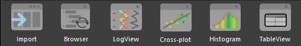

## Отображение данных

При первом открытии пользователь увидит следующее окно, в котором по умолчанию сразу заданы кривые для отображения. В примере ниже это NPHI для оси Y, RHOB для оси X. Также обозначено, что эти кривые будут взяты из датасета с именем LQC. Все эти параметры можно поменять, если просто перенести другой датасет в соответствующее поле, либо другую кривую в поле с именем кривой.

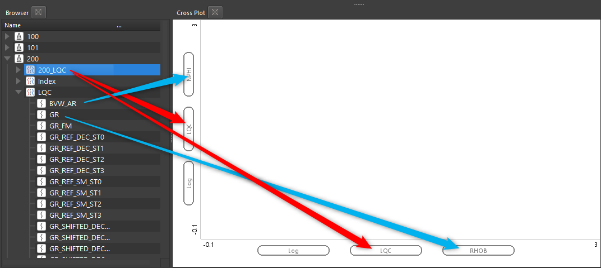

???+ "Видео пример"
	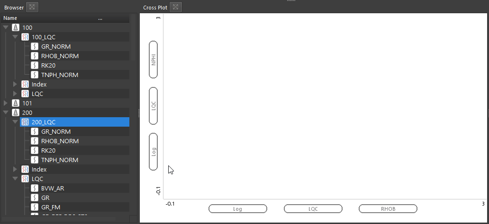

Когда нужные кривые обозначены, достаточно перенести одну или несколько скважин в поле кроссплота:

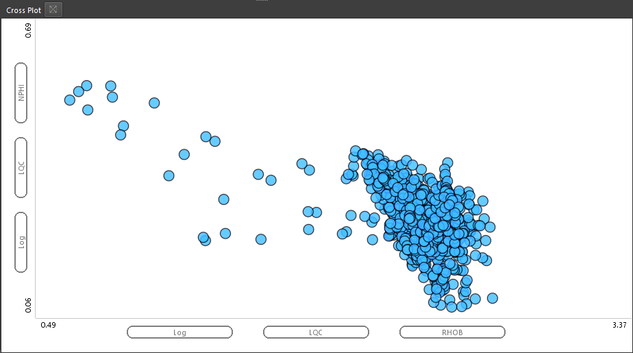

Кроме того,  имеется возможность использовать третью кривую в качестве закраски. Для этого кривую нужно закинуть в центральную часть окна. Например, используем кривую гамма активности:

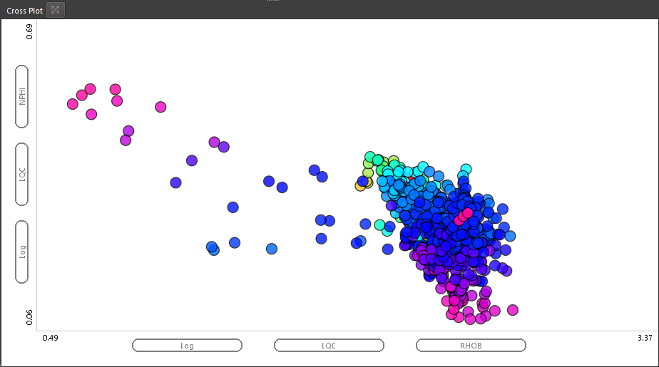

Если вы закинули кривую для отображения в качестве цвета, при этом точки стали черными, это означает, что у вас в проекте нет ни одной созданной палитры. При этом видно, что в поле выбора палитры ничего не выбрано:

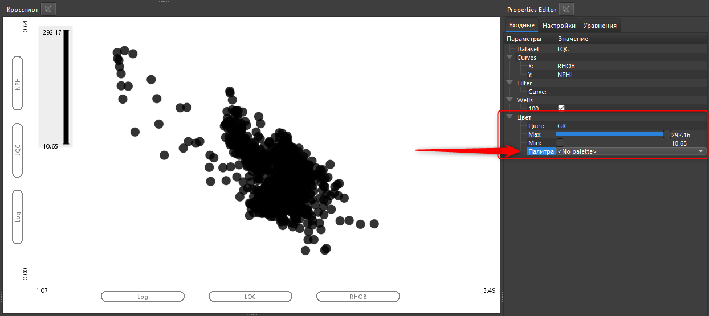

Процесс создания палитры описан [в данном разделе](../common/palette_basics.md)

Когда вы создали палитру, можно  выбрать ее в соответствующем разделе и увидеть на графике. При этом появится графическая легенда данной палитры:

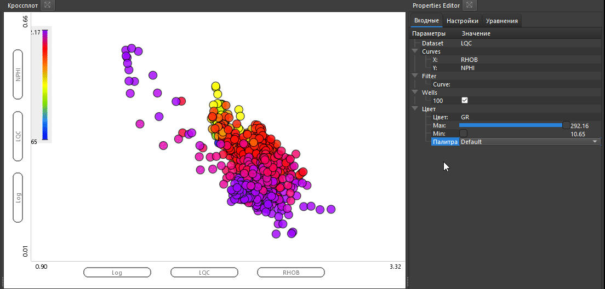

Далее можно закидывать другие скважины целиком. Данные для отображения будут выбираться в соответствии с заданными фильтрами (в нашем случае – NPHI, RHOB, GR, набор данных LQC).

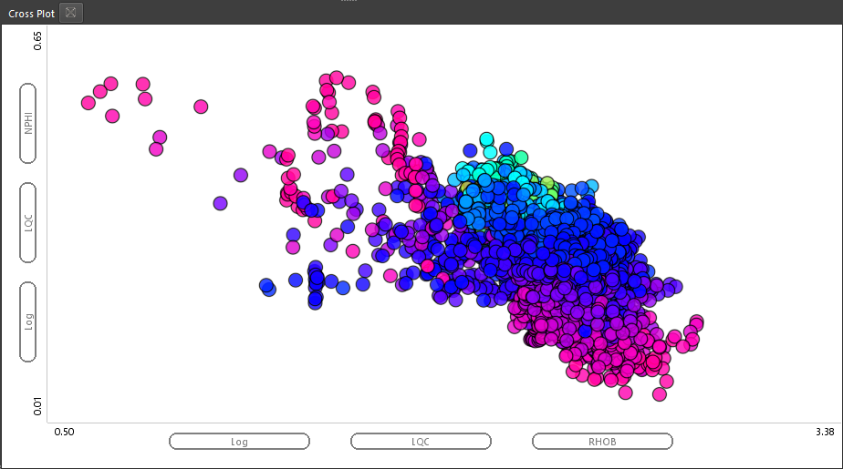

Перемещение по кроссплоту стандартное для ПО Гамма:
- с зажатой левой кнопкой мыши можно перемещать весь кроссплот
- колесом мыши с зажатой кнопкой CTRL приближать и отдалять весь график (одновременно изменять масштаб осей X и Y)
- с зажатой кнопкой SHIFT и вращением колеса мыши будет изменяться масштаб только по оси X
- также пользователь может ввести точно нужные ему значения масштабов по осям

???+ Example ":fontawesome-brands-youtube: Видео пример"
	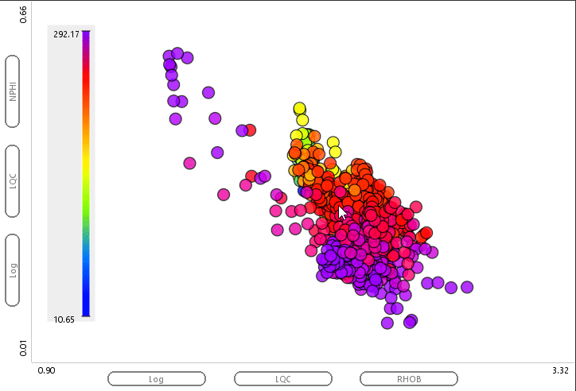


## Основные настройки
### Настройка параметров отображения палитры

Пользователь может настроить максимум и минимум для отображения палитры:

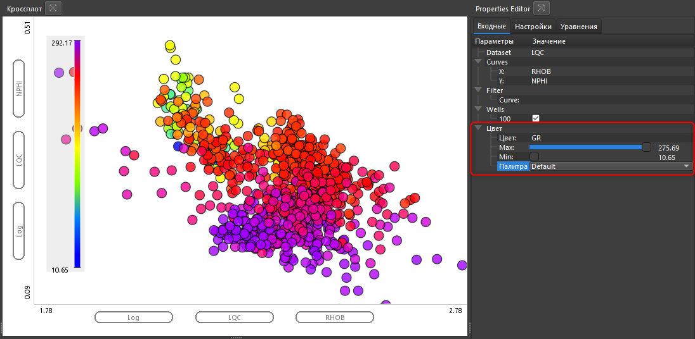


???+ Example ":fontawesome-brands-youtube: Видео пример"
	

### Включение и отключение скважин

В свойствах кроссплота можно динамически включать и отключать скважины

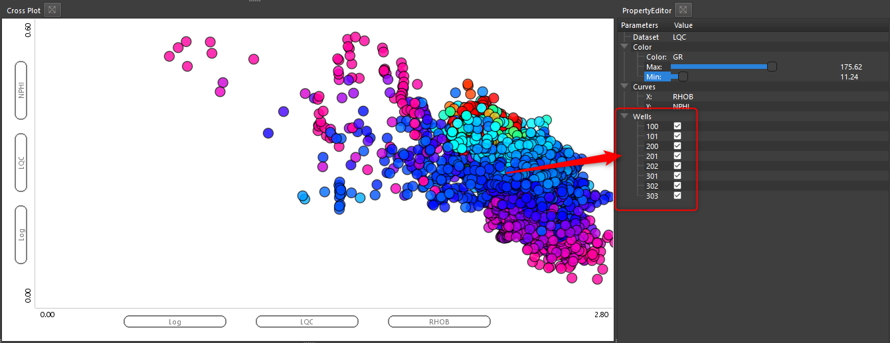


### Использование дискретной кривой в качестве фильтра

Пользователь может использовать любуюдискретнуюю кривую, чтобы задать ее в качестве фильтра для кроссплота. Для этого достаточно просто перенести нужную кривую из браузера проекта в поле Filter -> Curve:

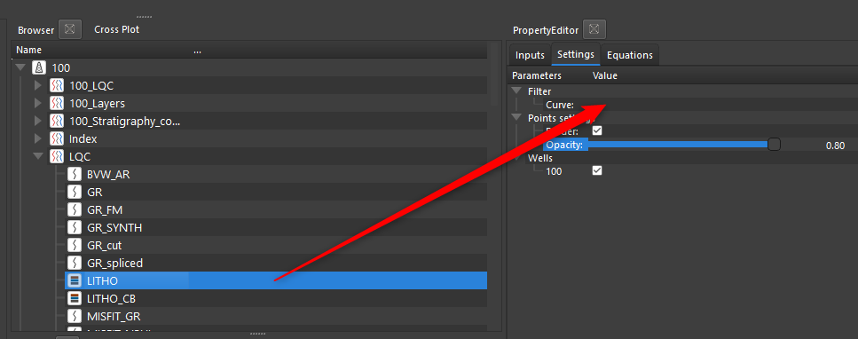

 В результате чего появятся все значения этой кривой и их можно будет включать и выключать, что будет влиять на отображение данных:
 
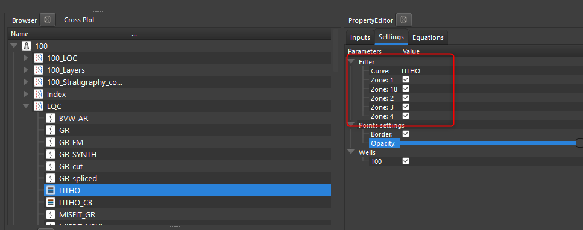


???+ "Видео пример"
	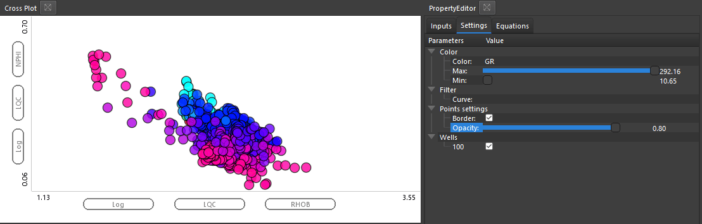


### Настройка прозрачности точек

Пользователь может настроить прозрачность отображения точек на графике:

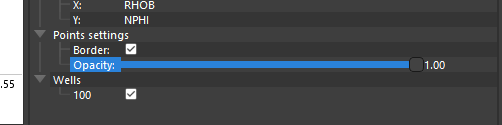


???+ Example ":fontawesome-brands-youtube: Видео пример"
	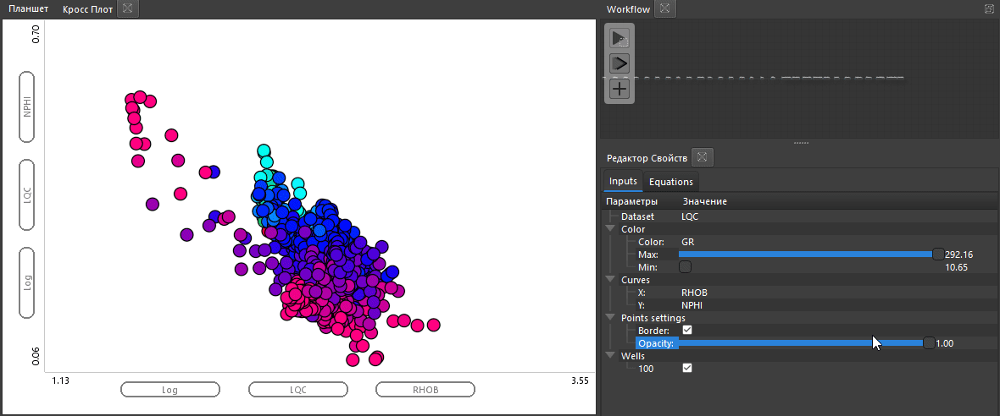

### Переключение на логарифмическую сетку

Любую из осей можно переключить с линейно на логарифмическое отображение. Для этого доступны соответствующие настройки в свойствах кроссплота:

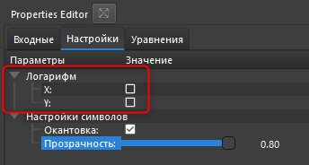


## Подбор оптимальной зависимости

Во вкладке Equations (зависимости), можно запустить алгоритм подбора зависимостей на основе любых данных, которые пользователь отображает на графике. Используется база из более чем 3500 уравнений для подбора оптимального решения. Для запуска алгоритма по любым отображаемым на кроссплоте данным, достаточно нажать кнопку **Run 2D Solver** в окне свойств кроссплота.

В результате запуска алгоритма показаны наилучшие 5 (или менее) уравнений для разных типов уравнений по среднеквадратическому отклонению. Пользователь может выбрать любое из них и оно отобразиться на графике:


С помощью настройки "Максимальное количество параметров" можно установить сколько будет участвовать параметров пи подборе. Минимальное количество 2, максимальное ограничено 6.

Пример уравнения с 2мя параметрами:

```
y=A+B/x, R2= 0.365 
```

??? "Уравнение на графике"
	

Пример уравнения с 3мя параметрами:

```
y=A+Bx^2+C(lnx)^2, R2= 0.370 
```

??? "Уравнение на графике"
	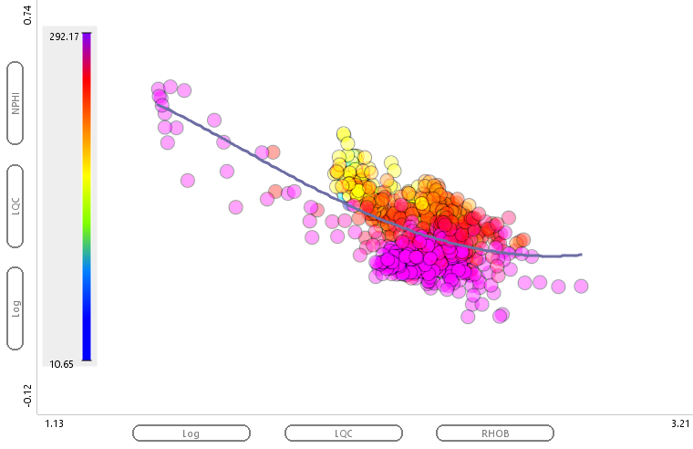

Пример в 5ю параметрами:

```
y=A+Bx+Ce^x+D(lnx)^2+Elnx/x, R2= 0.394
```

??? "Уравнение на графике"
	

При увеличении количества параметров коэффициент корреляции R2 будет всегда расти, однако уравнение будет становиться все более сложным. Пользователь сам должен решить сколько коэффициентов приемлемо ему для решения текущей задачи.

## Сохранение кроссплота

Для сохранения кроссплота достаточно нажать [rmb](../../terms/basics/rmb.md) в любом месте на графике и выбрать Save Plot (Сохранить график):

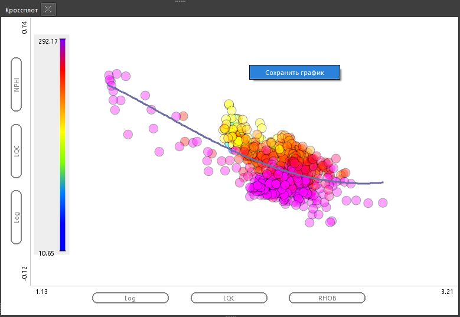

В окне сохранения будет предложено имя для графика. По умолчанию будет предложено имя, которое формируется из имени графика и данных на осях.

График будет сохранен в БД в группе кроссплотов:

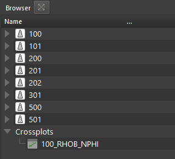

Для того, чтобы открыть этот график, достаточно перетащить его на любое открытое окно кроссплота:

???+ Example ":fontawesome-brands-youtube: Видео пример"
	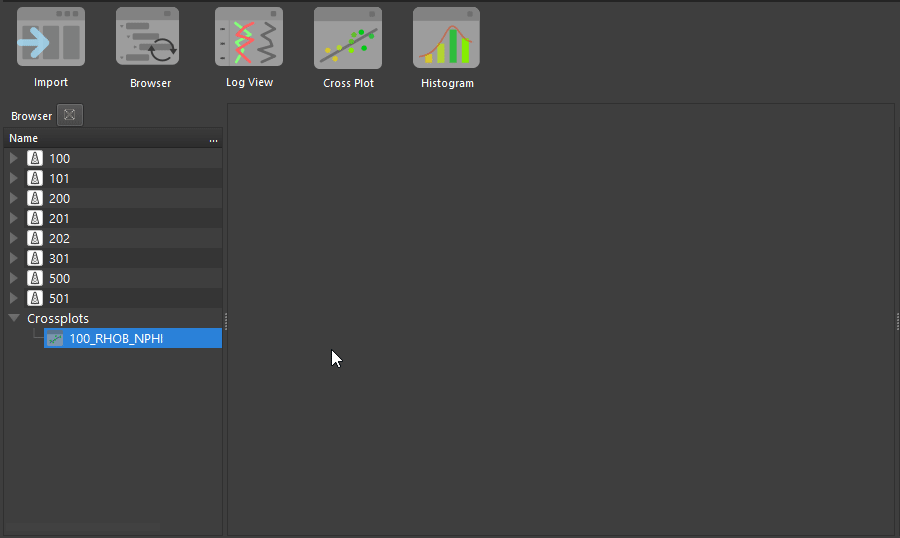