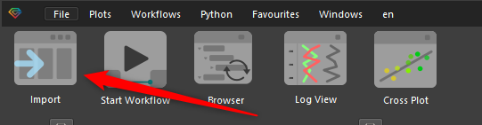
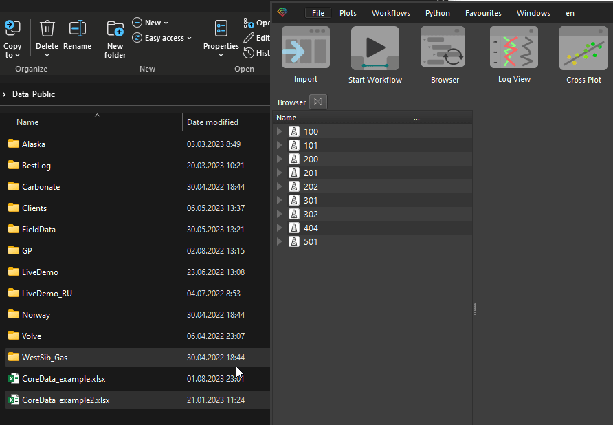
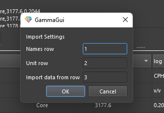
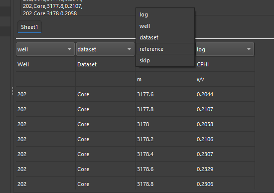
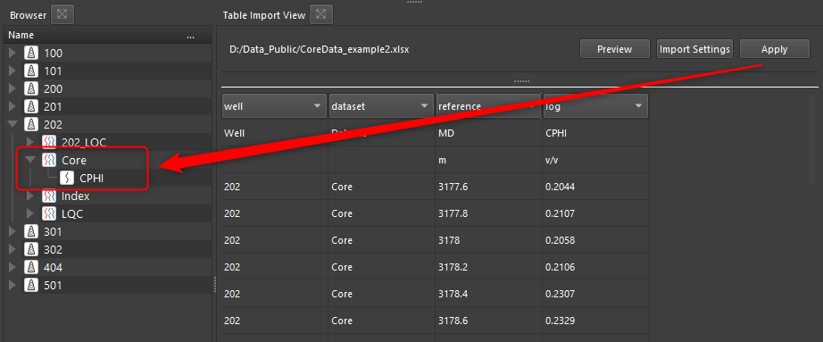
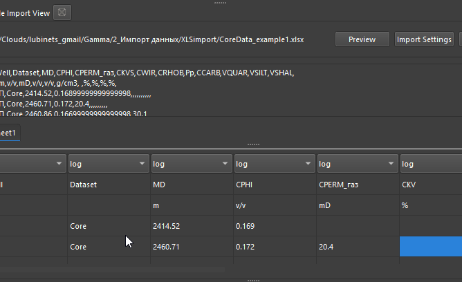
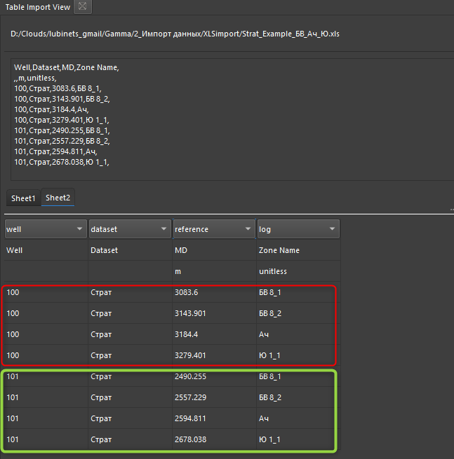

# Загрузка табличных данных

Загрузка любых данных в продукте начинается с кнопки загрузки данных (Import), расположенной в верхней части ПО:

Также пользователь может просто перетащить нужный ему файл в [project_browser](../ux/basic_widgets/project_browser.md) из файлового менеджера.

Гамма распознает тип файла и откроет подходящий тип загрузчика для этих данных. В данной статье мы рассматриваем загрузку табличных данных из файлов XLS или XLSX.

В файлах табличного вида могут быть загружена почти любая информация, но чаще всего загружаются следующие данные:
+ данные геохронологии, [[стратиграфия]] и [[маркеры]]
+ [core_data](../theory/core_data.md), включая интервалы отбора, описания и прочее
+ [[инклинометрия]]
+ [[заголовки скважин]]

При загрузке Excel файлов откроется инструмент настройки содержимого следующего вида:

Графически данный инструмент разделен на 2 части: верхняя показывает файл в его исходном виде, а нижняя - то представление, которое было распознано в соответствии с настройками при загрузке.

Далее пользователю необходимо убедиться, что файл загружается с нужной строки, а также, что строка заголовка данных и единиц измерения определены правильно. Данные настройки можно поменять нажав на кнопку **Import Settings**:

При этом откроется соответствующее окно настроек:

Далее пользователю необходимо настроить типы загружаемых данных, т.е. определить какие из колонок определяют имя скважин (Well), какие датасеты (dataset), где расположена глубина или другой референс (Reference). Все колонки с самими данными для загрузки помечаются как **log**:

После того как все настройки сделаны, можно проверить корректность параметров нажав кнопку Preview. При этом, если обнаружатся ошибки либо в настройках, либо в самой таблице, они будут отображены в [Окне отображения информации](../ux/basic_widgets/journal.md)

Если ошибок не обнаружено, то для загрузки в БД Гаммы обозначенной информации, необходимо нажать **Apply**. После чего данные попадут в БД продукта:

Перед загрузкой данных, пользователь может изменить как имена загружаемых кривых, так и их единицы измерения. Также это можно сделать и на следующем этапе в БД.

Если в исходном файле будут находиться данные по нескольким скважинам, то все данные будут загружены в соответствующие им скважины.

