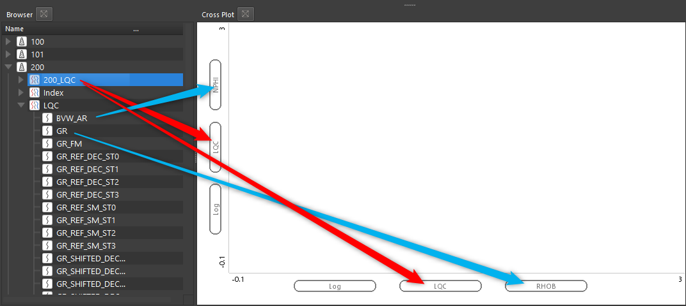
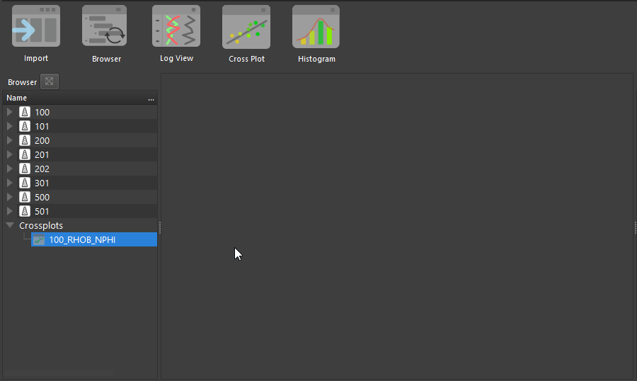

# Кроссплот

Для построения графиков доступен инструмент кросс-плот, который открывается нажатием соответствующей кнопки на панели:

# Отображение данных

При первом открытии пользователь увидит следующее окно, в котором по умолчанию сразу заданы кривые для отображения. В примере ниже это NPHI для оси Y, RHOB для оси X. Также обозначено, что эти кривые будут взяты из датасета с именем LQC. Все эти параметры можно поменять, если просто перенести другой датасет в советующее поле, либо другую кривую в поле с именем кривой.

Видео

Когда нужные кривые обозначены, достаточно перенести одну или несколько скважин в поле кросс-плота:

Кроме того,  имеется возможность использовать третью кривую в качестве закраски. Для этого кривую нужно закинуть в центральную часть окна. Например, используем кривую  
гамма-активности:

Далее можно закидывать другие скважины целиком. Данные для отображения будут выбираться в соответствии с заданными фильтрами (в нашем случае – NPHI, RHOB, GR).

Перемещение по кросс-плоту стандартное для ПО Гамма:
- с зажатой левой кнопкой мыши можно перемещать весь кросс-плот
- колесом мыши с зажатой кнопкой CTRL приближать и отдалять весь график (одновременно изменять масштаб осей X и Y)
- с зажатой кнопкой SHIFT и вращением колеса мыши будет изменяться масштаб только по оси X
- также пользователь может ввести точно нужные ему значения масштабов по осям

Пример

# Основные настройки
## Настройка параметров отображения палитры

Пользователь может настроить максимум и минимум для отображения палитры:

Пример

## Включение и отключение скважин

В свойствах кроссплота можно динамически включать и отключать скважины

## Использование дискретной кривой в качестве фильтра

Польователь может использовать любую дисткретную кривую, чтобы задать ее в качестве фильтра для кроссплота. Для этого достаточно просто перенести нужную кривую из браузера проекта в поле Filter -> Curve:

 В результате чего появятся все значения этой кривой и их можно будет включать и выключать, что будет влиять на отображение данных:
 

Пример

## Настройка прозрачности точек

Пользователь может настроить прозрачность отображения точек на графике:

Пример

# Подбор оптимальной зависимости

Во вкладке Equations (зависимости), можно запустить алгоритм подбора зависимостей на основе любых данных, которые пользователь отображает на графике. Используется база из более чем 3500 уравнений для подбора оптимального решения. Для запуска алгоритма по любым отображаемым на кросс-плоте данным, достаточно нажать кнопку Run 2D Solver в окне свойств кросс-плота.

В результате запуска алгоритма показаны наилучшие 5 или менее уравнений для разных типов уравнений по среднеквадратическому отклонению. Пользователь может выбрать любое из них и оно отобразиться на графике:

# Сохранение кроссплота

Для сохранения кросс-плота достаточно нажать [ПКМ](../Термины/ПКМ.md) в любом месте на графике и выбрать Save Plot (Сохранить график):

В окне сохранения будет предложено имя для графика. По умолчанию будет предложено имя, которое формируется из имени графика и данных на осях.

График будет сохранен в БД в группе кросс-плотов:

Для того, чтобы открыть этот график, достаточно перетащить его на любое открытое окно кросс-плота:

