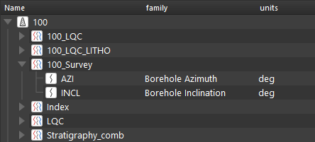

Инклинометрия может быть загружена в односкважинном и многоскважинном режимах.

Поддерживаются любые форматы, в которых могут храниться данные инклинометрии, такие как LAS или табличные данные (XLS, XLSX)

Для автоматического расчета инклинометрии необходимо загрузить 2 типа данных:
- Угол искривления скважины. Кривая может называться например INCL, тип данных Borehole Inclination
- Азимут скважины. (кривая может называться например AZIM, тип данных Borehole Azimuth.

Про обработку инклинометрии можно почитать в соответствующем разделе: [Расчет инклинометрии](../Предобработка%20данных/Расчет%20инклинометрии.md)