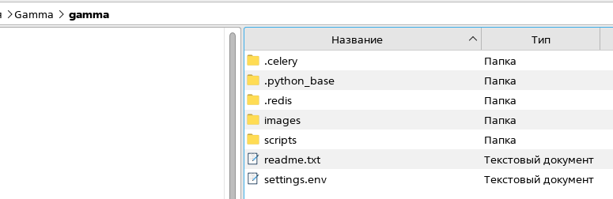
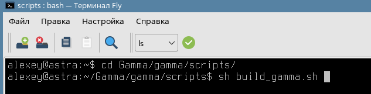
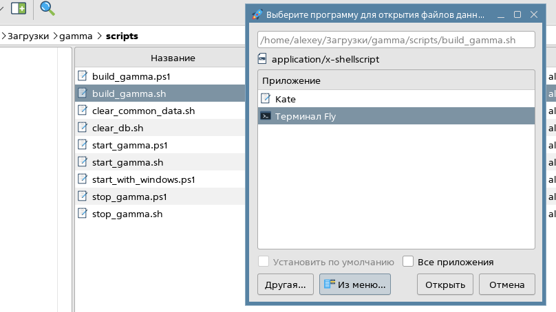
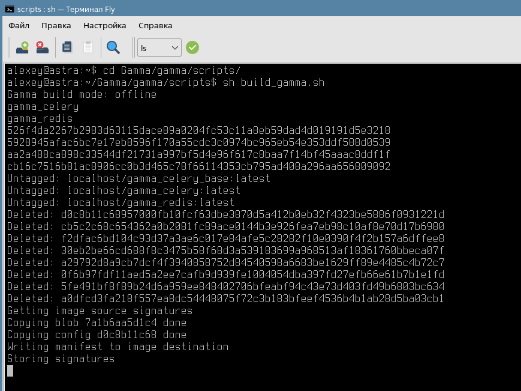
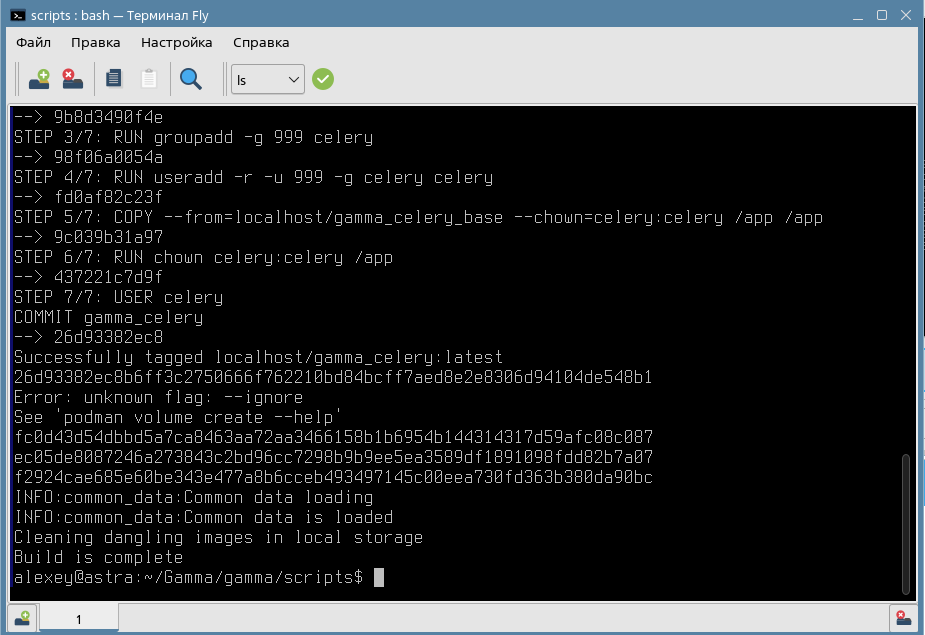

Первичная установка серверной части ПО или его обновление производятся полностью одиноково.

**ВАЖНО. Пользовательские данные в БД при обновлении будут сохранены.**

1. Необходимо скачать файл с дистрибутивом серверной части:
https://gamma-wellbore.com/download/server_linux_podman/

2. Разархивировать скаченный дистрибутив:

3. Зайти в папку в папку scripts через терминал (Terminal Fly):

Самый простой способ открыть папку со скриптом в терминале - это нажать на файл build_gamma.sh правой кнопкой мыши и в контекстном меню выбрать - "Открыть с помощью". Далее выбрать Terminal Fly (опция "Из меню") и нажать Открыть:

Обновление серверной части может занять около 5 минут:

И закончится сообщением, что процесс завершен успешно (Build is complete):

Можно закрывать окно и продолжать работать в обновленной версии ПО.

Обновление серверной части происходит гораздо реже, чем обновление клиентской (интерфейсной) части, про который можно прочитать здесь: [Обновление дистрибутива пользовательского интерфейса для Astra Linux](Обновление%20дистрибутива%20пользовательского%20интерфейса%20для%20Astra%20Linux.md)