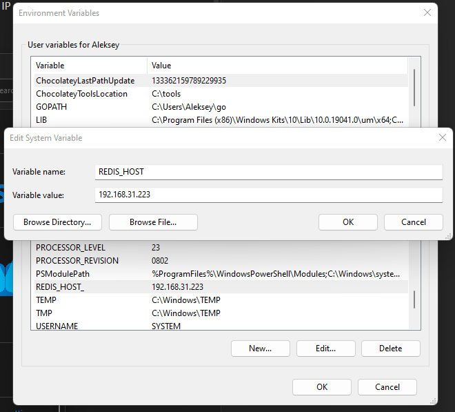

Если база данных и расчетная часть установлена на отдельном сервере ([второй вариант установки](../Другое/Варианты%20установки%20ПО.md)), то необходимо указать IP адрес сервера, для связи между интерфейсной частью и удаленной базой данных.

Для этого, нужно добавить новую переменную окружения **CELERY_REDIS_HOST** = IP адрес сервера

Пример такой конфигурации для IP адреса 192.168.0.10:

Кроме того, если пользователь планирует использовать Python и запускать пользовательские скрипты на своей рабочей станции, то необходимо прописать адрес базы данных в переменных окружения:

REDIS_HOST = X.X.X.X

Если [[../../Термины/Python IDE]] (например [[VS Code]]) для написания программного кода Python был запущен в момент добавления данной переменной окружения, то [[../../Термины/Python IDE]] нужно перезагрузить для того, чтобы изменения вступили в силу.

В случае если интерфейсная часть программы и база данных установлены на одном компьютере, то ничего прописывать в переменных окружения не нужно.

### Связанные ссылки

[Ссылки для скачивания](../Другое/Ссылки%20для%20скачивания.md)

[podman.io](https://podman.io/)